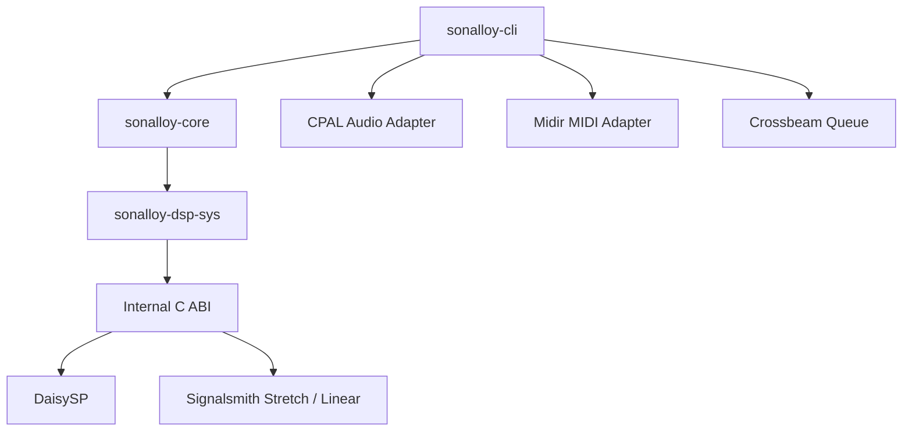

# アーキテクチャ

## 本書の範囲

本書ではSonalloyの**静的な構造**（クレート構成、依存方向、外部との境界、所有関係）を説明します。読後に、どのクレートが何を所有し、外部依存をどこで止めているかを判断できることを目的とします。

| 本書で扱わない内容 | 参照先 |
|---|---|
| 実行時の動作（処理契約、ライフサイクル、エラー時の扱い） | `docs/runtime-processing.md` |
| CLIの使い方・Option・Exit Code | `docs/cli.md` |
| 音源定義（JSON）の形式と制約 | `docs/instrument-definition.md` |
| テストと試聴の手順 | `docs/testing-and-sound-review.md` |

## クレート構成

3つのRustクレートと、C/C++のネイティブDSPライブラリから成ります。参照は一方向で、下位クレートは上位クレートを参照しません。

| クレート | 役割 | 依存しないもの |
|---|---|---|
| `sonalloy-cli` | 引数解釈、Offline MIDI→Event変換、WAV出力、Realtime Session、診断表示、終了コード | DaisySPのFFIを直接呼ぶこと |
| `sonalloy-core` | 処理契約、Definitionの読込と検証、Compile、Runtime、Render | CLIフレームワーク（clap）、WAV / MIDI入出力（hound / midly）、オーディオAPI（cpal / midir / crossbeam-queue）、C++ヘッダー |
| `sonalloy-dsp-sys` | 内部C ABIの宣言と、生ポインタを隠蔽するSafe Rustラッパー | — |

RealtimeでもOfflineでも音声は同じ`sonalloy-core`の処理契約を通ります。そのためDeviceやQueueといった外部I/Oの依存を`sonalloy-cli`へ集約し、Coreを環境非依存に保ちます。

## `sonalloy-cli`

CLIはユーザー入力の解釈と、OSのAudio / MIDI Deviceとのやり取りを担います。

Realtime Sessionは、次の要素で構成されます。

| 要素 | 責務 |
|---|---|
| Main Thread | Device選択、DefinitionのCompile、RuntimeのPrepare、Streamの起動 |
| Audio Callback | 準備済みRuntimeとNative DSP Handleを排他的に所有し、Planar Stereo出力をDevice形式へ変換する |
| MIDI Callback | Live MessageをProcess Eventへ変換し、固定容量Queueへ送る |
| Status | Queue Overflow・Process Error・Device ErrorをSessionへ伝える |

CoreはDevice名、Port ID、CPAL / Midir型を参照しません。Queueの整列規則などRealtimeの動作の詳細は`docs/runtime-processing.md`を参照してください。

## `sonalloy-core`

処理契約と実行時の仕組みを提供します。

| モジュール | 担当 |
|---|---|
| `process` | 処理契約と共通ライフサイクル |
| `definition` | 音源定義の読み込みと検証 |
| `parameter` | 正規パラメータID、記述子、カタログ、正規化・逆正規化 |
| `compiler` | 音源定義から`CompiledInstrument`への変換。Asset読み込み、各Generatorの準備、Layer遅延補償を含む |
| `asset` | SHA-256照合、WAV読み込み、Planar化、サンプルレート変換、Prepared Audioの共有 |
| `spectral` | STFTによるSpectral Assetの準備 |
| `wavetable` | Wavetable AssetのFrame分割とBand Table生成 |
| `runtime` | Voice、Source、Route、ADSR、Layer、各Generator、Processor Chain |
| `render` | オフラインレンダリングループ、Event、Tempo Mapの供給 |
| `diagnostics` | 表示に依存しないエラーコード、重要度、メッセージ |

GeneratorはネイティブDSPへの依存の有無で2系統に分かれます。

| 分類 | Generator | 備考 |
|---|---|---|
| Core Rust専用 | Additive、Formant、Spectral、Physical String | Physical Stringは共通Fractional DelayとDeterministic ExciterをRuntimeが所有 |
| ネイティブDSP利用 | Oscillator、Filter、Wavefold、Modal、Time Stretch | Modalは`sonalloy-dsp-sys`経由のPinned DaisySP `Resonator`。他も同じNative境界を使う |

Assetはコンパイル時に読み込み、デコード済みのPrepared Audioを`Arc`で共有します。Sample・Granular・Wave Sequence・SpectralはStereo Channelを保持し、WavetableだけMonoへDownmixします。コンパイル時・実行時の振る舞いの詳細は`docs/runtime-processing.md`を参照してください。

## `sonalloy-dsp-sys`

ネイティブDSPライブラリのビルドと、Rustからの安全な呼び出し窓口を提供します。

| 項目 | 内容 |
|---|---|
| DaisySP | V1.0.0を固定Commitで取得し、CMakeでビルドして静的リンクする。Modal用に`PhysicalModeling/resonator.cpp`を追加し、WavefolderはMIT版を使用する |
| Time Stretch | Signalsmith Stretch 1.3.2とSignalsmith Linear 0.3.1をリポジトリ同梱のソースからビルドする（ネットワーク接続不要） |
| 公開範囲 | DaisySPのクラス名・列挙型はラッパーの内部に留め、DefinitionとCoreの公開APIでは波形・Noise・出力Modeといった音源上の概念として扱う。これらの概念の所有はCoreにある |
| ハンドル | WavefolderとModalのNative Objectは不透明ハンドルへ閉じ込め、WavefolderはAmount、ModalはFrequency・Structure・Brightness・Decayの固定Ramp APIだけを公開する |

## Native境界

C ABIは`sonalloy-dsp-sys`とネイティブDSPの間の**内部境界**であり、外部製品向けの公開ABIではありません。

Rust側はネイティブのC++ Objectを不透明ハンドルとして所有し、生ポインタをSafe Rustラッパーの内側に隠します。ハンドルの`Send`実装は、一意所有・非共有アクセス・Thread affinityなしの条件を満たすWrapperに限定して許可します。これはAudio Callbackへの所有移動に必要な最小範囲です。

ネイティブ側の異常（ヌルハンドル、引数・バッファ違反、NaN・Infinity、C++例外）はすべて整数の結果コードへ正規化され、Rust側へは安全な値だけが渡ります。バッファ容量は`prepare`で確定し、処理中にネイティブ側で拡張しません。Time Stretchが報告するOutput LatencyはCompiled Layerへ渡り、Layer間の遅延補償に使われます。

## 所有関係

フェーズごとに誰が何を所有するかを示します。各フェーズの動作の詳細は`docs/runtime-processing.md`を参照してください。

| フェーズ | 所有するもの |
|---|---|
| Compile | 変更不能な`CompiledInstrument`（Metadata、Performance、有効Layer、Processor Chain、Parameter Catalog、Source、Route、Asset Warning）。`sonalloy-core`が所有し、Parameter IDをDense Handleへ解決する |
| Prepare | `InstrumentRuntime`の可変状態。Scratch Buffer、Generator State、同時発音数分のVoiceを実行前に確保する |
| Process / Reset | Prepareで確保した状態を再利用する。Resetは準備時と同じ初期状態を復元する |
| Realtime Session | `sonalloy-cli`がCPAL Stream、Midir Connection、固定容量Event Queue、Statusを所有する |

`CompiledInstrument`は変更不能で、Runtimeが持つ可変状態（Base Smoother、External Control、Voice Source、Generator Cursor、Processor State）を書き戻す先はありません。Voice Stealingでは、Layer・Generator・Processor・Modulation Sourceをまとめて1つのVoice Stateとして切り替えます。
