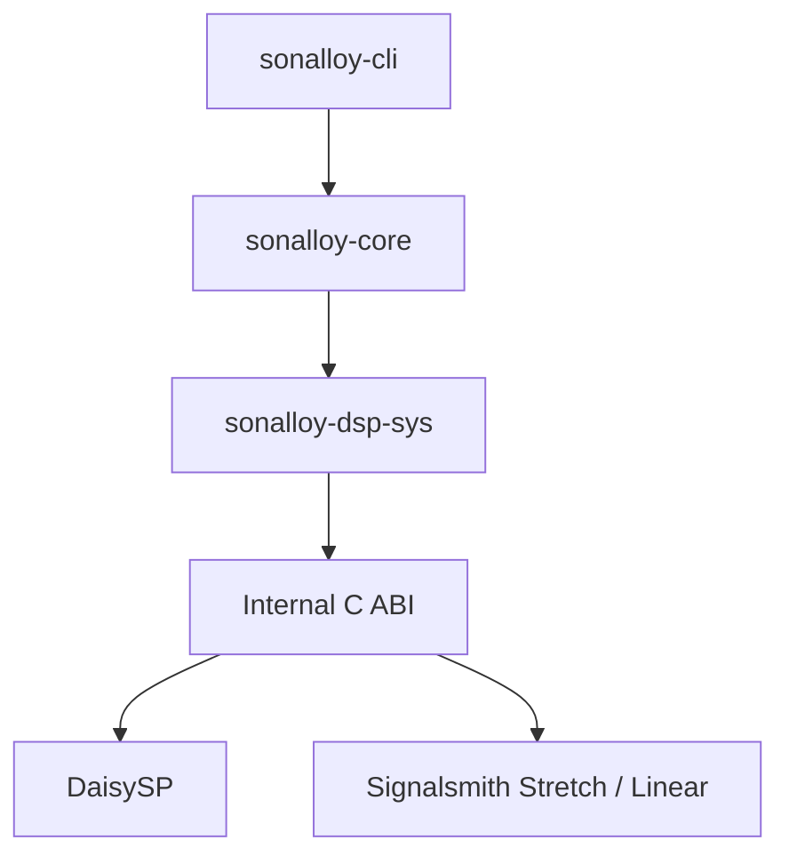
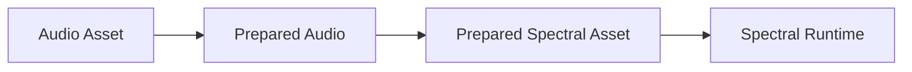

# アーキテクチャ

## 本書の範囲

本書ではSonalloyの**静的な構造**を説明します。クレート構成、クレート間の参照関係、外部との境界、所有関係です。

| 本書で扱わない内容 | 参照先 |
|---|---|
| 実行時の動作（Process仕様、Lifecycle、Error時の扱い） | `docs/runtime-processing.md` |
| CLIの使い方・Option・Exit Code | `docs/cli.md` |
| Instrument Definition（JSON）の形式と制約 | `docs/instrument-definition.md` |
| テストと試聴の手順 | `docs/testing-and-sound-review.md` |

## 部品の関係

参照は一方向です。下位のクレートは上位のクレートの存在を知りません。



- `sonalloy-core` は、CLIやclap、hound、midly、C++ヘッダー、Audio Device APIを知りません
- `sonalloy-cli` は `sonalloy-core` のRendererを呼び出し、Coreが返したPlanar AudioをWAVファイルへ変換します

## 部品の構成

### `sonalloy-core`

Process仕様と実行時の仕組みを提供します。

| Module | 担当 |
|---|---|
| `process` | Process仕様と共通のLifecycle |
| `definition` | Instrument Definitionの読み込みとValidation |
| `parameter` | Canonical Parameter ID、Descriptor、Normalize / Denormalize、Catalog |
| `compiler` | DefinitionからCompiled Instrumentへの変換、Prepared Audio共有、Wavetableの帯域制限Tableと固定Operator Topology、Granular Region、Wave Sequence Step、Additive Partial、Formant ProfileとSine Table、Spectral Asset A/BとInverse Planの準備・Channel検証 |
| `asset` | SHA-256照合、WAV読み込み、Planar Mono / Stereo化、Sample Rate変換、Prepared Audio共有 |
| `spectral` | Periodic HannによるSTFT、Magnitude / Phase / Instantaneous Frequencyの準備、Synthesis Window正規化、Real FFT Plan共有 |
| `wavetable` | Wavetable AssetのFrame分割、FFT/IFFTによるBand Table生成、Guard Sample付与 |
| `runtime` | Shared Parameter State、Voice、Source、Route、ADSR、Layer、Generator、Sample、Time Stretch、Granular、Wave Sequence、Wavetable、Private Partial Bank、Additive、Formant、Operator Modulation、Spectral、Processor Chain |
| `render` | Offline Render Loop、Event、Tempo Mapの供給 |
| `diagnostics` | 画面表示に依存しないError Code、Severity、Message |

Compileの段階でZone、Granular、Wave Sequence、Wavetable、SpectralのAsset読み込みを完了し、同じCache Keyを持つDecode済みのMono / Stereo Prepared Audio、Prepared Wavetable、またはPrepared Spectral Assetを`Arc`で共有します。Sample、Granular、Wave Sequence、SpectralはStereo Channelを保持し、Wavetableだけが既存のMono Preparation契約で処理します。WavetableのFFTとTable生成、SpectralのSTFTとInverse Plan、Time StretchのLatency測定、GranularのRegion Frame変換、Wave SequenceのStep Region Frame変換はCompile中に行います。Process中は、Prepareで確保したScratch Buffer、Native Handle、Compiled Generator、Layer遅延補償Buffer、固定Grain Pool、Wave Sequenceの最大2 Playback Slot、SpectralのInverse FFT / OLA Bufferだけを使います。

Operator Modulationは外部Assetを持たず、4 Operatorの固定TopologyをCompile時に`evaluation_order`、`incoming_masks`、`carrier_mask`へ解決します。Runtimeはこの固定配列とVoiceごとのPhase、Previous Output、Operator Envelopeだけを使い、任意Graphや文字列LookupをProcessへ持ち込みません。

Additiveは外部Native依存を持たないCore Rustの専用Generatorです。Compile時にDefinitionのPartial Slot、Dynamic Parameter Handle、4096点Sine Tableを確定し、VoiceごとのPhaseとSpectral RampだけをRuntimeへ生成します。Partial BankはDefinitionやCLIのGenerator Variantとして公開しない非公開実装Primitiveです。

FormantはAdditiveと同じPartial Bankを使うCore Rustの専用Generatorです。Compile時に1〜8個のProfile、各5本のBand、4つのDynamic Parameter Handle、4096点Sine Tableを確定し、VoiceごとにProfile補間、Gaussian Spectrum、Spectral Control Tick、Phaseを保持します。FormantのDefinitionはCLIのGenerator Variantとして公開しますが、Partial Bankは内部Primitiveに留めます。

Spectral ResynthesisはCore Rustの専用Generatorです。Compile時に`asset_a`と指定された`asset_b`をPrepared Audioへ変換し、FFT SizeごとのPrepared Magnitude、Absolute Phase、Instantaneous Frequency、Normalized Synthesis Window、共有Inverse PlanをCompiled Instrumentへ確定します。A/BのChannel数が一致しない場合はCompile Error、Bが指定されていて準備できない場合はSpectral LayerをUnavailableとします。RuntimeはVoiceごとのPhase Accumulator、Magnitude Blur State、Hop Scheduler、OLA Bufferを使い、Position、Freeze、Root Note Pitch、Layer Tuning、Frequency Shift、正規化タイムライン上のMorphを処理します。SpectralのFFT処理はNative DSPへ依存しません。

Harmonic / Formant Hybridは既存のLayer、Voice、Global Processor ChainとModulation Tableをそのまま組み合わせます。Formant、Additive、Sample、NoiseのLayer Mix、MIDI Event、Processor Stateは新しいNative責務を追加せず、既存のCompile / Prepare / Process / Reset境界で所有します。

Spectralの参照Definitionは[`spectral-generator-reference.json`](../examples/instruments/spectral-generator-reference.json)と[`spectral-hybrid-reference.json`](../examples/instruments/spectral-hybrid-reference.json)です。前者はStereo A/B Asset、Position、Freeze、Blur、Shift、Morph、Root Note、Phase Resetを一つのLayerで確認し、後者はSpectral、Additive、Sample、Noiseを既存のLayer / Voice / Global Processor ChainとModulation Routeへ接続します。Spectral LayerのReported LatencyはCompiled Instrumentの最大Layer Latencyとして扱い、ほかのGenerator LayerにはPrepare時に同じ時間位置になる遅延補償を確保します。



### `sonalloy-dsp-sys`

Internal C ABIの宣言と、Raw Pointerを隠蔽するSafe Rust Wrapperを提供します。

- DaisySP V1.0.0（コミット`a0494a3adb67f549e18dfd71a35fa656f65b38b6`）をCMakeでBuildし、Static LibraryとしてLinkします
- Native Wrapperは、DaisySPの`oscillator.cpp`、`variableshapeosc.cpp`、`svf.cpp`、MIT版`wavefolder.cpp`をBuild対象に追加します
- Time Stretch Wrapperは同梱したSignalsmith Stretch 1.3.2（`57b93f4e9206a089a45387eaa39bdc9f310d3308`）とSignalsmith Linear 0.3.1（`5668673560146a9cfe38c25315071e3fd68c8317`）をC++17でBuildします。Build時のNetwork Downloadは行いません
- DaisySPのClass名やEnumはWrapperの内側に留め、DefinitionやCoreのPublic APIには露出しません。SonalloyのOscillator Waveform、Noise Stream、Output ModeはCoreが所有します
- Wavefolderは`DspWavefolder`のOpaque Handleへ閉じ込め、CoreへはAmount 0〜1の製品Parameterだけを公開します。DaisySP-LGPLの`Fold`はBuild対象に含めません

### `sonalloy-cli`

引数解釈（clap）、MIDI→Event変換、WAV出力（hound）、Diagnostics表示、Exit Codeを担当します。DaisySPのFFIは直接呼びません。

## Native境界

C ABIは、`sonalloy-dsp-sys`からNative Wrapperを呼ぶための内部境界です。外部製品向けのPublic ABIではありません。

```c
typedef struct sonalloy_dsp_oscillator sonalloy_dsp_oscillator;
typedef struct sonalloy_dsp_variable_oscillator sonalloy_dsp_variable_oscillator;
typedef struct sonalloy_dsp_filter sonalloy_dsp_filter;
typedef struct sonalloy_stretch sonalloy_stretch;

sonalloy_dsp_oscillator* sonalloy_dsp_oscillator_create(void);
int32_t sonalloy_dsp_oscillator_prepare(...);
int32_t sonalloy_dsp_oscillator_reset(...);
int32_t sonalloy_dsp_oscillator_reset_phase(...);
int32_t sonalloy_dsp_oscillator_process(...);
int32_t sonalloy_dsp_oscillator_process_with_pulse_width(...);
int32_t sonalloy_dsp_oscillator_process_ramp(...);
int32_t sonalloy_dsp_oscillator_process_ramp_with_pulse_width(...);
void sonalloy_dsp_oscillator_destroy(...);
sonalloy_dsp_variable_oscillator* sonalloy_dsp_variable_oscillator_create(void);
int32_t sonalloy_dsp_variable_oscillator_prepare(...);
int32_t sonalloy_dsp_variable_oscillator_reset(...);
int32_t sonalloy_dsp_variable_oscillator_process(...);
int32_t sonalloy_dsp_variable_oscillator_process_ramp(...);
void sonalloy_dsp_variable_oscillator_destroy(...);
sonalloy_dsp_filter* sonalloy_dsp_filter_create(void);
int32_t sonalloy_dsp_filter_prepare(...);
int32_t sonalloy_dsp_filter_reset(...);
int32_t sonalloy_dsp_filter_process(...);
int32_t sonalloy_dsp_filter_process_ramp(...);
int32_t sonalloy_dsp_filter_process_ramp_with_resonance(...);
void sonalloy_dsp_filter_destroy(...);
sonalloy_stretch* sonalloy_stretch_create(void);
int32_t sonalloy_stretch_prepare(...);
int32_t sonalloy_stretch_reset(...);
int32_t sonalloy_stretch_set_pitch(...);
int32_t sonalloy_stretch_seek(...);
int32_t sonalloy_stretch_process(...);
int32_t sonalloy_stretch_flush(...);
int32_t sonalloy_stretch_input_latency(...);
int32_t sonalloy_stretch_output_latency(...);
int32_t sonalloy_stretch_interval_samples(...);
void sonalloy_stretch_destroy(...);
```

Native関数はNull Handle、引数、Buffer、NaN / Infinity、例外を検査して整数のResult Codeへ変換します。`prepare`でChannel数、Sample Rate、最大Input / Output Frame数を確定し、Process中にNative側のCapacityを増やしません。Stretchの`seek`は開始位置のInput Latencyを先行投入し、`flush`は終端に残るOutputを排出します。Rust側はC++ ObjectをOpaque Handleとして所有し、Output LatencyをCompiled Layerへ渡します。

## Lifecycle

詳しい流れは`docs/runtime-processing.md`の「Lifecycle」を参照してください。ここでは所有関係だけを説明します。

- **Compile**：Definitionを、Parameter Catalog、Source Table、Target別Route Tableを確定した変更不能な`CompiledInstrument`へ変換し、Parameter IDをDense Handleへ解決します（`sonalloy-core`が所有します）
- **Prepare / Process / Reset**：`InstrumentRuntime`の状態を進めます。Scratch Buffer、Time Stretch Backend、Granularの64 Slot固定Grain Pool、Wave SequenceのCurrent / Next Playback Slot、Additive / Formant Partial Bank、Layer遅延補償Buffer、Native HandleはPrepareで確保し、Process中には拡張しません
- Polyphony数分のVoiceはPrepare時に生成し、Voice StealingではLayer、Generator、Processor、Modulation Sourceを同じVoice Stateとして切り替えます。ResetはFresh Runtimeと同じ初期状態を復元します

`CompiledInstrument`はDefinitionのMetadata、Performance、Enabled Layer、Layer/Voice/Global Processor Chain、Parameter Catalog、Source、Route、Asset Warningを保持します。Runtimeが持つBase Smoother、External Control、Voice Source、Generator Cursor、Layer/Voice/Global Processor StateはCompiled値から作る可変状態で、DefinitionやCompiled Instrumentへ書き戻しません。
