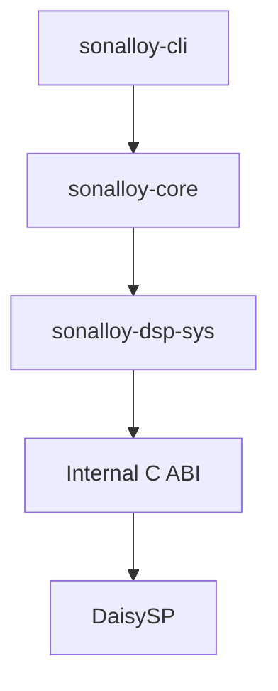

# アーキテクチャ

## 本書の範囲

本書ではSonalloyの**静的な構造**を説明します。クレート構成、クレート間の参照関係、外部との境界、所有関係です。

| 本書で扱わない内容 | 参照先 |
|---|---|
| 実行時の動作（Process仕様、Lifecycle、Error時の扱い） | `docs/runtime-processing.md` |
| CLIの使い方・Option・Exit Code | `docs/cli.md` |
| Instrument Definition（JSON）の形式と制約 | `docs/instrument-definition.md` |
| テストと試聴の手順 | `docs/testing-and-sound-review.md` |

## 部品の関係

参照は一方向です。下位のクレートは上位のクレートの存在を知りません。



- `sonalloy-core` は、CLIやclap、hound、midly、C++ヘッダー、Audio Device APIを知りません
- `sonalloy-cli` は `sonalloy-core` のRendererを呼び出し、Coreが返したPlanar AudioをWAVファイルへ変換します

## 部品の構成

### `sonalloy-core`

Process仕様と実行時の仕組みを提供します。

| Module | 担当 |
|---|---|
| `process` | Process仕様と共通のLifecycle |
| `definition` | Instrument Definitionの読み込みとValidation |
| `parameter` | Canonical Parameter ID、Descriptor、Normalize / Denormalize、Catalog |
| `compiler` | DefinitionからCompiled Instrumentへの変換 |
| `asset` | SHA-256照合、WAV読み込み、Mono変換、Sample Rate変換 |
| `runtime` | Shared Parameter State、Voice、Source、Route、ADSR、Layer、Generator、Sample、Processor Chain |
| `render` | Offline Render LoopとEventの供給 |
| `diagnostics` | 画面表示に依存しないError Code、Severity、Message |

Compileの段階でファイルの読み込みを完了し、Decode済みのMono Sampleを`Arc`で共有します。Process中は、Prepareで確保したScratch Buffer、Native Handle、Compiled Sampleだけを使います。

### `sonalloy-dsp-sys`

Internal C ABIの宣言と、Raw Pointerを隠蔽するSafe Rust Wrapperを提供します。

- DaisySP V1.0.0（コミット`a0494a3adb67f549e18dfd71a35fa656f65b38b6`）をCMakeでBuildし、Static LibraryとしてLinkします
- Native Wrapperは、DaisySPの`oscillator.cpp`と`svf.cpp`だけをBuild対象に追加します
- DaisySPのClass名やEnumはWrapperの内側に留め、DefinitionやCoreのPublic APIには露出しません。SonalloyのOscillator Waveform、Noise Stream、Output ModeはCoreが所有します

### `sonalloy-cli`

引数解釈（clap）、MIDI→Event変換、WAV出力（hound）、Diagnostics表示、Exit Codeを担当します。DaisySPのFFIは直接呼びません。

## Native境界

C ABIは、`sonalloy-dsp-sys`からNative Wrapperを呼ぶための内部境界です。外部製品向けのPublic ABIではありません。

```c
typedef struct sonalloy_dsp_oscillator sonalloy_dsp_oscillator;
typedef struct sonalloy_dsp_filter sonalloy_dsp_filter;

sonalloy_dsp_oscillator* sonalloy_dsp_oscillator_create(void);
int32_t sonalloy_dsp_oscillator_prepare(...);
int32_t sonalloy_dsp_oscillator_reset(...);
int32_t sonalloy_dsp_oscillator_reset_phase(...);
int32_t sonalloy_dsp_oscillator_process(...);
int32_t sonalloy_dsp_oscillator_process_with_pulse_width(...);
int32_t sonalloy_dsp_oscillator_process_ramp(...);
int32_t sonalloy_dsp_oscillator_process_ramp_with_pulse_width(...);
void sonalloy_dsp_oscillator_destroy(...);
sonalloy_dsp_filter* sonalloy_dsp_filter_create(void);
int32_t sonalloy_dsp_filter_prepare(...);
int32_t sonalloy_dsp_filter_reset(...);
int32_t sonalloy_dsp_filter_process(...);
int32_t sonalloy_dsp_filter_process_ramp(...);
int32_t sonalloy_dsp_filter_process_ramp_with_resonance(...);
void sonalloy_dsp_filter_destroy(...);
```

Native関数はNull Handle、引数、Buffer、例外を検査して整数のResult Codeへ変換します。Process中にNative側で新規にメモリを確保することはありません。

## Lifecycle

詳しい流れは`docs/runtime-processing.md`の「Lifecycle」を参照してください。ここでは所有関係だけを説明します。

- **Compile**：Definitionを、Parameter Catalog、Source Table、Target別Route Tableを確定した変更不能な`CompiledInstrument`へ変換し、Parameter IDをDense Handleへ解決します（`sonalloy-core`が所有します）
- **Prepare / Process / Reset**：`InstrumentRuntime`の状態を進めます。Scratch BufferとNative HandleはPrepareで確保し、Process中には拡張しません

`CompiledInstrument`はDefinitionのMetadata、Performance、Enabled Layer、Layer/Voice/Global Processor Chain、Parameter Catalog、Source、Route、Asset Warningを保持します。Runtimeが持つBase Smoother、External Control、Voice Source、Generator Cursor、Layer/Voice/Global Processor StateはCompiled値から作る可変状態で、DefinitionやCompiled Instrumentへ書き戻しません。
