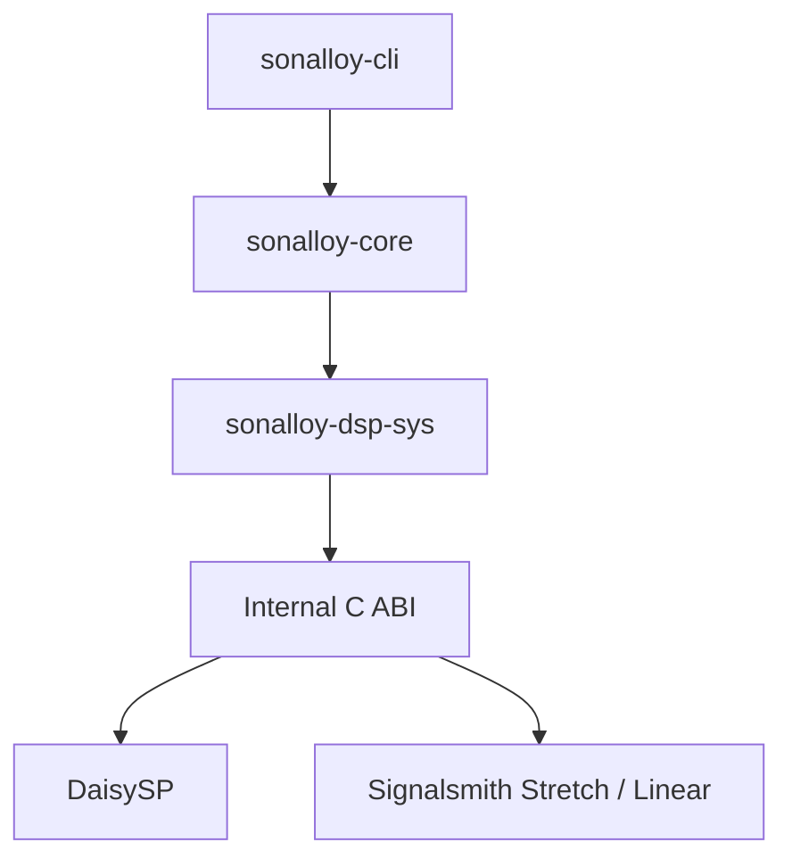

# アーキテクチャ

## 本書の範囲

本書ではSonalloyの**静的な構造**（クレート構成、依存関係、外部との境界、所有関係）を説明します。

| 本書で扱わない内容 | 参照先 |
|---|---|
| 実行時の動作（処理契約、ライフサイクル、エラー時の扱い） | `docs/runtime-processing.md` |
| CLIの使い方・Option・Exit Code | `docs/cli.md` |
| Instrument Definition（JSON）の形式と制約 | `docs/instrument-definition.md` |
| テストと試聴の手順 | `docs/testing-and-sound-review.md` |

## クレート構成

3つのRustクレートと、C/C++のネイティブDSPライブラリから成ります。参照は一方向で、下位クレートは上位クレートの存在を知りません。

| クレート | 役割 | 依存しないもの |
|---|---|---|
| `sonalloy-cli` | 引数解釈、MIDI→イベント変換、WAV出力、診断表示、終了コード | DaisySPのFFIを直接呼ばない |
| `sonalloy-core` | 処理契約、Definitionの読込と検証、Compile、Runtime、Render | CLI、clap、hound、midly、C++ヘッダー、オーディオデバイスAPI |
| `sonalloy-dsp-sys` | 内部C ABIの宣言と、生ポインタを隠蔽するSafe Rustラッパー | — |

## `sonalloy-core`

処理契約と実行時の仕組みを提供します。

| モジュール | 担当 |
|---|---|
| `process` | 処理契約と共通ライフサイクル |
| `definition` | 音源定義の読み込みと検証 |
| `parameter` | 正規パラメータID、記述子、カタログ、正規化・逆正規化 |
| `compiler` | 音源定義から`CompiledInstrument`への変換。Asset読み込み、各Generatorの準備、Layer遅延補償を含む |
| `asset` | SHA-256照合、WAV読み込み、Planar化、サンプルレート変換、Prepared Audioの共有 |
| `spectral` | STFTによるSpectral Assetの準備 |
| `wavetable` | Wavetable AssetのFrame分割とBand Table生成 |
| `runtime` | Voice、Source、Route、ADSR、Layer、各Generator、Processor Chain |
| `render` | オフラインレンダリングループ、Event、Tempo Mapの供給 |
| `diagnostics` | 表示に依存しないエラーコード、重要度、メッセージ |

GeneratorはネイティブDSPへの依存の有無で2系統に分かれます。

| 分類 | Generator | 備考 |
|---|---|---|
| Core Rust専用 | Additive、Formant、Spectral | ネイティブDSPに依存しない |
| ネイティブDSP利用 | Oscillator、Filter、Wavefold、Time Stretch | `sonalloy-dsp-sys`経由 |

Assetはコンパイル時に読み込み、デコード済みのPrepared Audioを`Arc`で共有します。Sample・Granular・Wave Sequence・SpectralはStereo Channelを保持し、WavetableだけMonoへDownmixします。コンパイル時・実行時の振る舞いの詳細は`docs/runtime-processing.md`を参照してください。

## `sonalloy-dsp-sys`

内部C ABIの宣言と、生ポインタを隠蔽するSafe Rustラッパーを提供します。

| 項目 | 内容 |
|---|---|
| DaisySP | V1.0.0（commit `a0494a3adb67f549e18dfd71a35fa656f65b38b6`）をCMakeでビルド・静的リンク。WavefolderはLGPL版でなくMIT版を選択 |
| Time Stretch | 同梱のSignalsmith Stretch 1.3.2・Linear 0.3.1をC++17でビルド（ネットワークダウンロードなし） |
| 公開範囲 | DaisySPのクラス名・列挙型はラッパー内に留め、DefinitionやCoreの公開APIへ露出しない。Waveform・Noise・Output Modeの所有はCore |
| Wavefolder | 不透明ハンドルへ閉じ込め、Amount 0〜1だけ公開。LGPL版はビルド対象外 |

## Native境界

C ABIは`sonalloy-dsp-sys`とネイティブDSPの間の**内部境界**です。外部製品向けの公開ABIではありません。

Rust側はネイティブのC++ Objectを不透明ハンドルとして所有し、生ポインタをSafe Rustラッパーの内側に隠します。ネイティブ側のエラー（ヌルハンドル、引数・バッファ違反、NaN・Infinity、C++例外）はすべて整数の結果コードへ正規化され、Rust側へは安全な値だけが渡ります。容量は`prepare`で確定し、処理中にネイティブ側で拡張しません。Time StretchのOutput LatencyはCompiled Layerへ渡り、Layer遅延補償に使われます。

## Lifecycle

詳しい流れは`docs/runtime-processing.md`を参照してください。ここでは所有関係だけを説明します。

| フェーズ | 所有・確保するもの |
|---|---|
| Compile | 変更不能な`CompiledInstrument`（Metadata、Performance、Enabled Layer、Processor Chain、Parameter Catalog、Source、Route、Asset Warning）。Parameter IDをDense Handleへ解決。`sonalloy-core`が所有 |
| Prepare | `InstrumentRuntime`の状態。スクラッチバッファ、Time Stretch Backend、Grain Pool、Playback Slot、Partial Bank、Layer遅延補償バッファ、ネイティブハンドル、同時発音数分のVoiceを生成 |
| Process / Reset | 確保した状態を再利用。Resetは準備時と同じ初期状態を復元 |

`CompiledInstrument`は変更不能で、Runtimeが持つ可変状態（Base Smoother、External Control、Voice Source、Generator Cursor、Processor State）は音源定義や`CompiledInstrument`へ書き戻しません。Voice StealingではLayer・Generator・Processor・Modulation Sourceを同じVoice Stateとして切り替えます。
