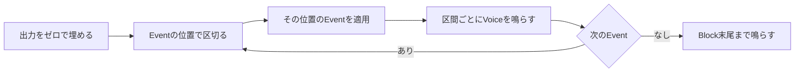
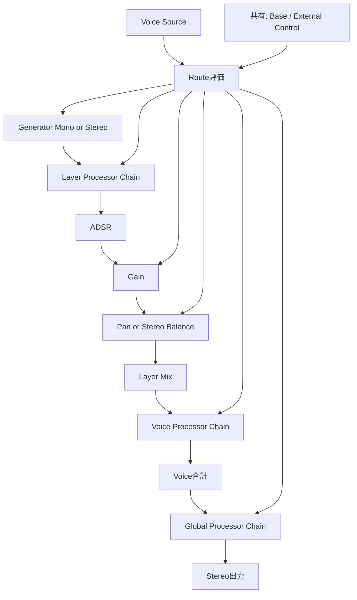
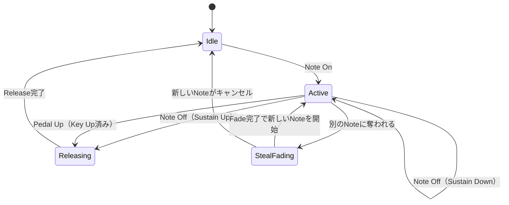
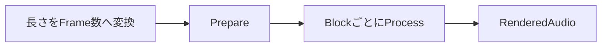

# 実行時の動作

本書ではSonalloy Coreが音を出す仕組みを、「1 Blockの処理 → 1つのNoteの一生 → Parameterの時間変化 → 実行上の約束事 → Realtime / Offlineの入り口」の順に説明します。音源定義（JSON）の各要素が、実際に鳴るときどう効くかを追えることが目的です。Generatorごとの違いは参照情報のため、末尾にまとめました。

| 本書で扱わない内容 | 参照先 |
|---|---|
| 部品の構造と所有関係 | `docs/architecture.md` |
| CLIの使い方・Option・Exit Code | `docs/cli.md` |
| 音源定義（JSON）の形式と制約 | `docs/instrument-definition.md` |

## Blockの処理

Coreへの1回の`process`呼び出しが、音の出力における最小単位です。音源は同時発音数分のVoiceを固定で持ち、呼び出しごとに最大Block SizeまでのStereo `f32` Bufferを埋めて返します。`process`には、処理するFrame数、Block先頭位置（`absolute_frame`）、そのBlockへ適用するEvent列、出力Bufferを渡します。



- 出力は先にゼロで埋めるため、前のBlockの内容が混ざることはありません
- EventにはBlock先頭からのSample位置（`sample_offset`）が付いており、その位置で正確に適用されます。音の計算は毎Sample行います
- Frame数が0のBlockは何もせず成功として返します

**Eventの規則**

扱うEventはNote On / Note Off、Sustain Pedal、Parameter Change、Pitch Bend、Mod Wheel、Aftertouchです。

| 規則 | 内容 |
|---|---|
| 順序 | Eventは`sample_offset`の昇順に並べ、同じ位置では渡された順番で適用します |
| 整列 | Event FileやMIDI FileなどOffline由来の入力は、同じFrameに重なったEventをSustain Pedal → Note Off → Parameter Change → Pitch Bend → Mod Wheel → Aftertouch → Note Onの順へ並べ替えてから渡します |
| 検証 | Parameter Handle、変換済みのParameter値、External Control値をBlock開始前に全件検証します。不正があればStateを変更せず、そのBlockを無音にします |

Parameter Changeの値はCatalogと同じ単位（TuningはCents、Filter CutoffはHz、GainはdB）で受け取ります。入力時に検証してから内部表現へ変換するため、音声処理が不正な値を受け取ることはありません。

### 外部Audioの処理

`ProcessBlock`は、出力とは別に定義が要求する0〜2個のRead-only Input Bufferを受け取ります。外部Audioを宣言しない音源はInputを持たず、Mono定義は1 Channel、Stereo定義は2 Channelを必ず渡します。Channel数、各BufferのFrame数、処理対象Sampleの有限性はProcess開始前に検証されます。

外部AudioのConsumerは固定されたGlobal経路へ接続されます。Envelope FollowerとDynamicsのExternal Sidechainは入力の振幅を左右リンクで解析し、Vocoderは左右別の24帯域Envelope、Envelope Transferは左右リンク振幅、Spectral Morphは左右別のSpectrumを使います。各ConsumerはCarrierと外部入力の処理遅延をCompile時に整列し、Spectral MorphはFFT 1024 / Hop 256で`-768`、`-512`、`-256`を含むVirtual leading zero paddingから解析を開始して1024 framesのLatencyを報告します。External Input Delayは0、1、2 framesをそれぞれ別の遅延として扱います。

Envelope Followerの値はInstrument ScopeのSourceとしてRouteへ供給されます。Global Processorは全Voiceの合計へ適用されるため、外部入力をOutputへ直接MixせずにSidechainや振幅・Spectrumの制御へ利用できます。外部入力を使うProcessorとFollowerの状態はResetで初期値へ戻ります。

## Noteの一生

1つのNoteは、発音から消音まで1つのVoiceに割り当てられます。Note Onから順に追います。

### 発音（Note On）

1. Trigger条件（Event・Key・Velocity）に合うLayerを持つNoteだけを受け付けます
2. Voiceを1つ選びます。空きVoice（Idle）を最優先し、なければ音量の最も小さいReleasing、次いで最古のActiveを奪います
3. `note_on`のLayerを開始し、`note_off`のLayerは対応するNote Offまで待機させます。待機Layerは音を出さずNote IDだけ保持します
4. Voiceを奪うときは、古い音を5msでフェードしてから新しいNoteを開始します（Voice Stealing）

### Voiceの中の信号経路

Layer内ではGenerator → Layer Processor → ADSR → Gain → Panの順に処理し、Trigger条件に合ったLayerの出力をDefinition順に加算します。加算された信号はVoice Processor Chainを通り、全Voiceの合計がGlobal Processor Chainを通ります。



図の「Route評価」は、Modulation Sourceから各段階のTargetへ値を供給する経路です（詳細は次章）。信号経路の各段階は次のように振る舞います。

| 段階 | 振る舞い |
|---|---|
| **ADSR** | Note OnでAttackから始まり、Decayを経てSustainで待機する。Sustain中のKey Upでは待機し、実際のRelease位置（通常のNote OffまたはPedal Up）で現在値からReleaseへ進む。長さ0の区間は飛ばす |
| **Gain** | Base値とRouteをdB Domainで加算してClampし、線形Gainへ変換する。Note開始Fade・ADSR・Dynamic Gainを順に乗算する |
| **Pan** | 定電力で左右へ振り分ける |
| **Tuning** | Base値とRouteをCentで加算し、Oscillatorの周波数またはSampleの再生速度へ変換する |
| **Processor** | 各配置で使える種類とFieldは`docs/instrument-definition.md`の[Processor](instrument-definition.md#processor)を参照。Dynamic ParameterはBlock内で滑らかに変化する。Modulation FXはGlobal Chainに1つのStateを共有し、Dynamicsは左右のPeakをリンクして判定する。Stereo GeneratorのLayer Stateは左右独立で、Mono GeneratorではMono側だけを確保する |
| **Global Tail** | Global Delay・Reverb・Chorus・Flanger・PhaserはActive Voiceがいなくても毎Block処理する。Noteの終了やVoice Stealingで停止・初期化されない |

### Note Off、Sustain、Stealing

| タイミング | 振る舞い |
|---|---|
| Note Off（Sustain Up） | Note IDでVoiceを探し、Activeな`note_on` Layerを現在のADSR値からReleaseへ移行 |
| Note Off（Sustain Down） | Key状態だけ解除し、VoiceはActiveのまま保持。Layer ADSR、Modulation Envelope、待機Layerの開始は行わない |
| Pedal Up | Key Up済みで保持中のVoiceへ、Note Offと同じRelease処理を適用。Keyが押下中のVoiceはReleaseしない |
| Note Off（待機Layerあり） | 待機していた`note_off` Layerを独立したADSRのAttackから開始。待機Layerがある間は、Note On Layerが先に終了してもVoiceを保持 |
| Steal開始 | 古い音を5msで音量ゼロへFade。Steal中の待機Layerは発音しない |
| Steal中のNote Off | 待機中の新しいNoteをキャンセルできる |
| Steal完了 | 待機していたNoteを開始し、待機状態を破棄 |
| Voiceの解放 | Active Layerと待機Layerがすべて終わったらIdleへ戻る |



Sustain Down中のNote OffはReleaseを保留するだけなので、VoiceはActiveのまま残ります。保留中かどうかはKeyの押下状態とPedalの状態で管理し、保留中のVoiceも通常どおりVoice Stealingの対象です。

### Performance Mode

PolyphonicではNoteごとにVoiceを割り当てます。MonophonicではVoiceを1つだけ使い、最後に押されたNoteを発音します。Current Noteを離したときに他のHeld Noteがあれば、最後に押されたHeld Noteへ戻ります。Sustainだけで保持されている音はHeld Noteではないため、新しいNoteとのLegato接続には使いません。

Monophonicの`legato`が有効なConnected Transitionでは、同じVoiceのGenerator、Layer / Voice Processor、Envelope、Modulation Sourceを継続し、Note ID・Note Number・Velocityだけを更新します。`legato`が無効なら新しいNoteとして再発音します。Note-off Trigger Layerは実際にReleaseへ入るNote Offでだけ開始します。

PortamentoはConnected TransitionとHeld Noteへの復帰にだけ適用され、Cents Domainで現在のPitchから新しいNoteへ滑らかに移動します。通常のLayer TuningやそのModulation Routeとは別に合成されるため、専用Parameterはありません。Sustainだけで残ったVoiceからの新しいNoteはFresh Startです。

## ParameterとModulation

音色の骨格は音源定義で決まりますが、フィルタの開きやビブラートのような動きは、実行中にParameterへ値を供給することで実現します。コンパイル済みの音源はParameter Catalog、Source Table、Target別Route Tableを持ち、音声処理では文字列IDではなく整数Handleだけを扱います。

| 要素 | 振る舞い |
|---|---|
| **Base Parameter** | Native Unit値をSmootherへ入れ、5ms（Filterは10ms、DelayとReverbは固定値）でTargetへ近づける |
| **Route** | 同じTargetについてDefinition順に、Curve後のSourceへ直接Depthを掛けて加算する。Linear TargetはNative Domain、Log2 TargetはOctave Domainで合計し、最後にClampする |
| **Parameter Span** | 最大32 Frame単位で全Voiceへ同じ値を渡す。VoiceごとのSourceはVoice単位でSpanを計算する |
| **Sourceの所属** | `velocity`・`key_tracking`・LFO・Modulation Envelope・Random・MSEG・Step・Sample & Hold・Smooth RandomはVoiceごと。Pitch Bend・Mod Wheel・Aftertouch・Macro・Beat Phase・Bar Phaseは全Voiceで共有するInstrument Source |
| **Note Off伝播** | Layer ADSR・Operator ADSR・Modulation Envelopeへ伝える。LFOとRandomはVoiceの終了まで保持し、終了時に初期値へ戻す |
| **Reset** | Base Parameter、Macro、Vector Axis、External Control、Held Note、Portamentoを定義の初期状態へ戻す |

連続するParameterはBlock内でStart / Endの値を受け取り、各Sampleへ補間します。Processorの種類・配置・順序、Filter Mode、EQ周波数、Delay容量などCompile時に決まる値は、Process中に変更できません。

Routeの加算順とClampの位置は、BlockやVoiceへの分割に依存しません。加算の計算式は`docs/instrument-definition.md`のModulationを参照してください。

## 実行上の約束事

RealtimeでもOfflineでも、Coreは次の契約に従います。ここがCoreの振る舞いに関する正本です。

**Prepare**

| フェーズ | 内容 |
|---|---|
| Prepare | 同時発音数分のVoiceを作り、Scratch Buffer・Physical String Delay・Native Modal Handle・Time Stretch Latency・Grain Pool・Wave Sequence Slot・Layer遅延補償Bufferを確保します。Sample RateがCompile時と異なる場合は失敗します（Block Sizeの変更だけは許可） |
| Reset | 全Voice・位相・ADSR・Noise Stream・Physical StringのDelay / Filter / Dispersion・Modal Resonator・Sample Cursor・Grain Pool・Wave Sequence Slot・Processor・External Audio Delay / Follower・Base Parameter・External Control・絶対位置を、初期状態へ戻します |
| Prepare失敗 | それまでの状態を破棄し、利用不可状態へ移行します |
| Process / Reset中のNative DSP失敗 | 出力を無音化してErrorを返し、未準備状態へ移行します。再利用にはPrepareが必要です |

**Process中に禁止する操作**

- JSONの解析、Fileの読み書き、Assetの読み込み・Sample Rate変換・Hash計算
- メモリの新規確保
- 通信、同期Log、Blockする待ち合わせ

**決定性**

ProcessはPrepareで確保したStateを使い回し、実行中に新しいStateを確保しません。Resetではこれらを初期値へ戻すため、同じEvent Sequenceを初期化直後のRuntimeとReset後のRuntimeへ与えた結果は一致します。

**エラー時の扱い**

- 不正な入力やContextの不一致はErrorとし、そのBlockの出力を無音にします
- Native側の失敗もRust側Processorの失敗も、原因を示すErrorとして報告します
- ErrorとExit Codeの対応は`docs/cli.md`を参照してください

## Realtime Adapter

Realtime演奏でもCLIは同じ`process`経由でCoreを呼びます。CoreはAudio Device APIやMIDI APIを参照しません。

**Callbackへの分割**

Host Callbackに渡されるFrame数は要求値と異なることがあるため、Adapterは1回のCallbackを最大Block Size以下のBlockへ分割します。Blockの`absolute_frame`は連続させ、実際に渡されたFrame数は最小・最大・回数として記録します。

**MIDI Eventの受け渡し**

- Live MIDI Eventは、接続開始からのTimestampと到着順を保持したまま固定容量4096のQueueに入ります
- Audio Callbackが次のBlockの先頭でQueueから取り出し、Timestampと到着順で整列して適用します。Audio Clockへの精密な変換はしないため、EventはBlock先頭の位置で鳴ります
- Queueが満杯になった場合は破棄や上書きを行わず、Sessionを停止します

**出力とDeviceの条件**

- Coreの出力は確保済みPlanar `f32` Stereoです。AdapterがDeviceのSample Formatへ変換し、ch 0 / 1へLeft / Rightを出力します。3ch以上では残りを無音にします
- Mono Device、PCM以外のFormat、要求Buffer非対応のDeviceはStream開始前に拒否します

**Callback内での動き**

Callbackで行うのはInput Queueからの固定Frame取り出し、Event Queueからの取り出し、`process`の呼び出しだけです。前章の禁止操作に加え、Device Queryも行いません。Device選択、DefinitionのCompile、RuntimeのPrepare、Input Streamの起動はCallback開始前に完了させておきます。

Audio Input CallbackはCPALのNative Sample Formatを`f32`のFrameへ変換して固定容量Queueへ書き込みます。Queueが空いたままOutput Callbackが進んだFrameは0で埋めてUnderflowを記録し、Queueが満杯のときは新しいInput Frameを破棄してOverflowを記録します。Input StreamのDevice Errorは致命的なAudio Input Errorです。Input Queueは固定容量で、Callback内のAllocationやBlockする待ち合わせを行いません。

`play`のTempoと拍子はSession開始時に固定されます。Audio CallbackのAbsolute FrameからBeat / Bar位置を求めて各Process Contextへ渡すため、Callbackの分割数が変わってもTempo同期Sourceの位置は変わりません。Macro CCは開始前にParameter Handleへ解決され、MIDI Callbackでは既存のParameter Changeへ変換されます。

**エラー時の扱い**

- Process Error、Audio Device Error、MIDI Error、Event Queue Overflowは出力を無音にして致命的状態へ遷移し、終了時に原因に対応する`PROCESS_ERROR` / `AUDIO_DEVICE_ERROR` / `MIDI_ERROR`を報告します。Input Underflow / OverflowはCounterを表示してSessionを継続します
- Realtime Schedulingの拒否はWarning、Xrunは回数として記録し、Sessionを継続します

## Offline Render

書き出しでは、CoreのRendererが同じ`process`をBlock単位で繰り返します。



- 長さは「秒 × Sample Rate」を整数へ丸め、Tail Frame数を足します
- `tempo_bpm`は正の有限値を受け付けます。Tempoと拍子を持つMusical Time Mapを使う場合、変更Frameを跨がないようにBlockを分割し、Beat / Bar位置をProcess Contextへ渡します
- 最後のBlockは残りFrame数だけ処理するため、余分なSampleはできません
- Coreは左右のSample列を返し、WAVへの変換はCLIが行います

### Musical Time

`ProcessContext`の`beat_position`はQuarter-note単位の連続位置、`bar_position`は小節単位の連続位置です。Tempo変更ではBeat / Barを連続させ、拍子変更ではBeatを連続させたまま新しい小節境界からBarを始めます。`transport_beat_phase`と`transport_bar_phase`はこの位置の小数部分を共有して参照します。

LFO、Step、Sample & Hold、Smooth Randomの`per_beat`、およびMSEGの`beats`はこのBeat位置を時間基準にします。Step切替、MSEG Segment終端、Random更新、Transport PhaseのWrapはProcess内の境界として扱い、境界をまたぐ値を一つの線形Spanへ混ぜません。

**開発用のSine Runtime**

`dev render-sine`で使う最小のRuntimeです。Voiceの仕組みを持たず、Event列を受け取るとErrorになります。Prepareで周波数（Nyquist以下）を検証し、Native Oscillatorの信号を左右へコピーします。

## Generatorの実行時振る舞い

ここからは参照用です。ここまでのBlock処理・Noteの一生・Modulationは全Generator共通で、以下はGeneratorごとに異なる振る舞いだけを示します。Fieldの制約・Rangeは`docs/instrument-definition.md`を参照してください。

### Oscillator

Note番号とTuningから周波数を決め、基本波形（Sine / Saw / Square / Triangle / Pulse）を生成します。

| 項目 | 振る舞い |
|---|---|
| 位相 | `phase_reset`が有効ならNoteごとにCompile時の初期位相へ戻す |
| 基本波形 | Pulse Width・Hard Sync Ratio・Waveshaping Amountは滑らかに変化 |
| Hard Sync | Master / Slaveで倍音を合成。Sineでは使えない |
| Unison | 固定Component数でDetune・位相・Stereo配置。2 Voice以上でStereo出力 |
| Phase Distortion（Sine限定） | 位相の非線形Map。Hard Syncと併用不可 |
| Feedback（Sine限定） | 直前Sampleで自己変調。Hard Syncと併用不可 |
| Wavefold | 全Waveformで使用できる |

### Noise

White / Pink / Brownを決定的乱数で生成します。Stereo Correlationで左右の相関を制御し、常にStereo出力します。

### Physical String

Mono Generatorです。Note開始時にDelay Line、Loop Filter、Dispersion All-pass、ExciterをResetし、Layer Hash・Note ID・定義のSeedから決まるExciterを1回だけ発生させます。Sustain中に自動で再励振することはありません。

```text
Exciter + Feedback
↓
Fractional Delay → Loop Low-pass → Dispersion All-pass → Feedback Gain
↓
Mono Output（Delayed Signal + Direct Exciter）
```

各SampleでNote FrequencyからFractional Delayの周期を求めます。`decay_seconds`は周波数ごとのFeedback GainへのT60変換、`brightness`はLoop Low-passの明るさ、`stiffness`は高次成分の遅れとして効きます。TuningとGenerator Targetは同じSpan位置式で補間するため、Block Sizeを変えても同じ時間軸をたどります。

Delay BufferとScratch BufferはPrepare時に確保し、Process中に拡張しません。Note OffではGeneratorを止めず、Layer ADSRのReleaseだけを後段で適用します。

### Modal

Mono Generatorです。Note開始時に共通ExciterとNative ResonatorのStateをResetし、Exciterの出力をRender Spanにつき1回Native側へ渡します。Native側はSpanのStart / Endから各SampleのFrequency・Structure・Brightness・Decayを補間し、固定Mode数で共鳴を計算します。

`structure`はMode間隔、`brightness`は高次Modeの残留、`decay`は共鳴のDampingを制御します。`mode_count`はCompile時に決まり、Render中に変わらず、Resetでは同じMode数・Sample Rateで初期化し直します。Native Errorや非有限出力時はBufferを無音化してErrorにします。

### Additive

1〜64個のPartialのSineを加算します。出力はMonoです。

| 項目 | 振る舞い |
|---|---|
| Morph | A/Bの振幅だけを補間（周波数・位相は不変） |
| Spectrum Tilt | 高域Partialの減衰傾斜 |
| Inharmonicity | 高域の周波数比を非整数化 |
| 高域の扱い | NyquistへClampせずPartialごとの消え方を維持し、滑らかに減衰 |
| 正規化 | 全PartialのEnergyで正規化 |
| ADSR | Partial個別のADSRを指定可。Layer ADSRはPartial合計の後に適用 |

### Formant

整数倍Partialへ母音共鳴の5本Bandを適用します。出力はMonoです。

| 項目 | 振る舞い |
|---|---|
| Vowel Position | 隣接Profileを補間（周波数・帯域幅は幾何平均、GainはdB線形） |
| Formant Shift | Bandの中心周波数と帯域幅だけを移動（基音Pitchは不変） |
| Throat | 帯域幅を拡大・縮小 |
| ADSR | Formant固有のものはなく、Layer ADSRをPartial合計の後に適用 |

### Wavetable

Compile時にWAVをFrame分割して帯域別Tableを作り、全Voiceで共有します。

| 項目 | 振る舞い |
|---|---|
| Voiceごとの状態 | Unison Component分の位相だけ |
| Position | Frame間を補間し、周波数帯に応じたTableを選んで帯域境界でCrossfade |
| Sample Rate | SourceのSample RateはPitchに使わない |
| 無効化 | Asset準備に失敗したLayerは発音候補から除外 |

### Spectral

Compile時にSTFT解析でMagnitude・絶対位相・瞬時周波数を準備し、全Voiceで共有します。

| 項目 | 振る舞い |
|---|---|
| 再構成 | 位相を累積してFrameを再構成し、Position・Freeze・Pitch・Shiftを適用して逆FFT・窓・Overlap-addで出力 |
| Morph / Blur | A/B Morphと時間方向のBlur。Mono / Stereoを保持 |
| Latency | `fft_size - hop_size`分を報告し、他Layerへ補償される |
| 無効化 | A/B Channel不一致はCompile Error。Bの準備失敗はLayer無効化（Aだけへはフォールバックしない） |

### Operator Modulation

4 OperatorをCompile時に確定した固定Topology順に評価します。実行時にAlgorithm名を参照しません。

| 項目 | 振る舞い |
|---|---|
| Mode | Phase（PM）/ Frequency（FM）/ Amplitude（AM）/ Ring |
| Carrier | Carrierだけが出力を持ち、他のOperatorは変調信号だけを供給 |
| Feedback | 直前Sampleで自己変調（AM / Ringでは不可） |
| Unison | 2〜4 VoiceでStereo、ADSRは全Componentで共有 |

### Sample

Compile時にZoneごとのRegion・方向・Loop・Time Modeを確定し、同じAssetのPrepared Audioを全Voiceで共有します。

| 項目 | 振る舞い |
|---|---|
| Zone選択 | NoteとVelocityで選び、同一条件のRound Robin GroupはDefinition順に交代 |
| Cursor | 4点補間で進み、Region外を参照しない |
| Loop | Region内に置き、Crossfadeで境界を滑らかに |
| Time Mode | `resample`（Pitchと連動）、`fixed_stretch` / `tempo_sync`（Pitchを保ってDurationだけ変える） |
| Latency | Time StretchのLatencyは他Layerへ補償。Reverseとは併用不可 |

### Granular

64 Slot固定のGrain PoolをVoiceごとに持ち、Sampleと同じPrepared AudioからGrainを生成します。

| 項目 | 振る舞い |
|---|---|
| Scheduler | 絶対Sampleタイムラインで動作し、Block Sizeに依存しない |
| Parameter | Position・Grain Size・Density・Pitch・Randomness・Pan SpreadはGrain開始時に確定させ、発音中のGrainへは後から適用しない |
| Window | Grainの出入りやDensity変更でも音量の段差が生じないよう、境界を連続的に正規化する |
| 乱数 | 定義のSeed・Layer・Note・Grain番号から決定的に算出し、Voice処理順に依存しない |
| Pan | Mono AssetはGrainごとに定電力PanでStereo配置 |
| Note Off | Grainを破棄せずLayer ADSRのReleaseへ進む。Positionを固定すればFreeze、LFO等で動かせばScrubになる |

### Wave Sequence

Compile時に各StepのAsset・Region・Duration・方向・Pitch・Gainを確定し、Voiceごとに現在Stepと次Stepの2 Slotを持ちます。

| 項目 | 振る舞い |
|---|---|
| Direction | Forward / Reverse / Ping Pong。Loop有効時だけ終端から先頭へ戻る |
| Duration | Seconds（Sample Rate基準）またはBeats（Tempo基準）。再生はOne-shotとLoopを選べる |
| Crossfade | 隣接Stepを定電力で混合 |
| 利用できないStep | 削除せず、Durationを保持した無音Stepとして進行（後続Stepの時間を変えない） |
| 終了 | 最後のOne-shot Stepを終えてLoop無しならGeneratorを終了。Note Off後は通常のLayer Lifecycleに従う |

### 複数Layerの同時発音

複数GeneratorはDefinitionのLayer順に同じVoiceへ加算されます。Formant（共鳴）+ Additive（倍音芯）+ Sample（Attack）+ Noise（Air）のように役割を分担できます。

| 項目 | 振る舞い |
|---|---|
| Parameter | 各GeneratorのDynamic Parameterは、単体と同じRoute評価へ統合される |
| Latency | SpectralのLatencyが最大のとき、他Layerへ遅延補償を確保してTransient位置を揃える |
| Voice Stealing | 全Layer・Processor・Sourceをまとめて1つのVoice Stateとして再初期化する |
