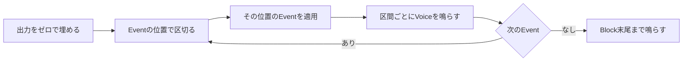
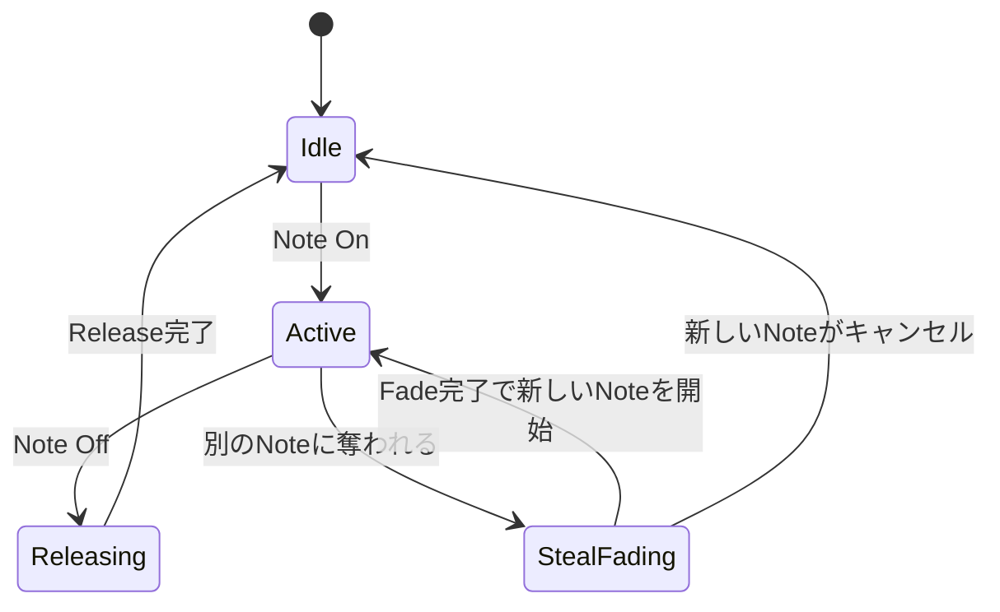
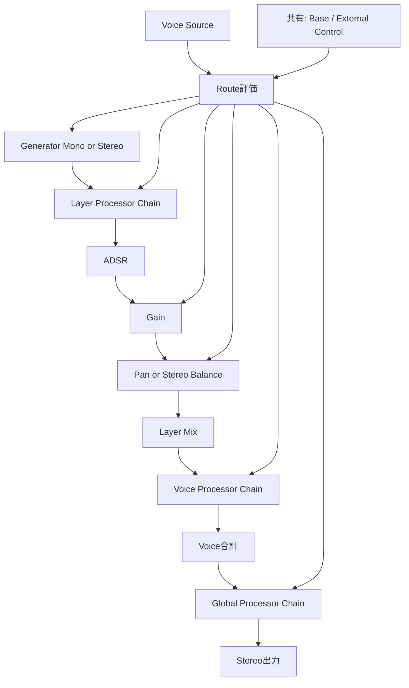
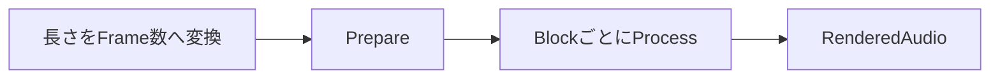

# 実行時の動作

## 本書の範囲

本書ではSonalloyの**実行時の動作**（Noteが鳴って消えるまでの仕組み、Blockの処理、各Generatorの振る舞い、準備とリセット、エラー時の扱い）を説明します。

| 本書で扱わない内容 | 参照先 |
|---|---|
| 部品の構造と所有関係 | `docs/architecture.md` |
| CLIの使い方・Option・Exit Code | `docs/cli.md` |
| Instrument Definition（JSON）の形式と制約 | `docs/instrument-definition.md` |

## 全体像

音源（Instrument Runtime）はPolyphony数分のVoiceを固定で持ち、`process`を呼ぶたびに1 Block（最大Block SizeまでのSample列）を出力します。



- 出力はStereoで、左右のChannelを分けた`f32`Bufferへ書き込みます
- EventはNote、Parameter Change、Pitch Bend、Mod Wheel、Aftertouchを含みます。音の計算は毎Sample行われます
- Note OnからNote Offまでの間、そのNoteは1つのVoiceへ割り当てられます

## Blockの処理

`process`へ渡すのは、処理するFrame数、Block先頭位置、Event列、出力Bufferです。EventはBlock内のSample位置（`sample_offset`）を持ち、その位置で正確に適用されます。

- 出力は先にゼロで埋み。前のBlockの残りは混ざりません
- 区間ごとのRenderとEvent適用を繰り返し、最後にBlock末尾まで鳴らします
- Frame数が0のBlockは何もせず成功扱いです

**Eventの規則**

| 規則 | 内容 |
|---|---|
| 順序 | Eventは`sample_offset`の昇順に並べます |
| 同一位置の優先順位 | Note Off → Parameter Change → Pitch Bend → Mod Wheel → Aftertouch → Note On |
| 検証 | Parameter Handle、Catalogへ変換済みのParameter値、External Control値はBlock開始前に全件検証します。不正EventがあればStateを変更せず、対象Blockを無音にします |

CLIなどのAuthoring Interfaceでは`Parameter Change`をCatalogのParameter Unit（TuningはCents、Filter CutoffはHertz、GainはDecibels）で受け取ります。FrontendはDescriptorで検証してからCoreの既存Process Eventへ正規化値として渡し、Runtimeはその値をBase Parameterへ設定します。Authoring JSONの`native_value`とCore EventのTransport表現を混同しません。

## Noteのライフサイクル



**Note On**

1. どのLayerのTrigger条件（Event / Key / Velocity）にも合わないNoteは無視します
2. Voiceを1つ選びます。優先順位は Idle → 最も音量の小さいReleasing → 最古のActive です
3. `note_on` Layerを開始し、`note_off` Layerを待機状態にします。待機Layerは音を出さずNote IDだけ保持します
4. 選んだVoiceがIdleなら即座に開始。空きがない場合は5msのFadeで古い音を消してから新しいNoteを開始します（Voice Stealing）

**Note OffとVoice Stealing**

| タイミング | 振る舞い |
|---|---|
| Note Off（通常） | Note IDでVoiceを探し、Activeな`note_on` Layerを現在のADSR値からReleaseへ移行 |
| Note Off（待機Layerあり） | 待機中の`note_off` Layerを独立したADSRのAttackから開始。待機Layerがある間は、Note On Layerが先に終了してもVoiceを保持 |
| Steal開始 | 古い音を5msで音量ゼロへFade。Steal中の待機Layerは発音しない |
| Steal中のNote Off | 待機中の新しいNoteをキャンセルできる |
| Steal完了 | 待機していたNoteを開始し、待機状態を破棄 |
| Voiceの解放 | Active Layerと待機Layerがすべて終わったらIdleへ戻る |

## Voiceの構成

Voiceは複数のLayer、Voice Source、Layer / Voice / Globalの3段階のProcessor Chainを持ちます。Layerは「Generator + Layer Processor + ADSR + Gain + Pan」のセットで、Trigger条件に合ったLayerだけが鳴ります。



| 要素 | 振る舞い |
|---|---|
| **ADSR** | Note OnでAttackから始まり、Decayを経てSustainで待機。Note Offで現在値からReleaseへ。長さ0の区間は飛ばす |
| **Gain** | Base値とRouteをdB Domainで加算してClampし、Linear Gainへ変換。Note開始Fade・ADSR・Dynamic Gainを順に乗算 |
| **Pan** | 定電力で左右へ振り分け |
| **Tuning** | Base値とRouteをcentで加算し、Oscillatorの周波数またはSampleの再生速度へ変換 |
| **Processor** | LayerはFilter / Drive / EQ / Resonator / Bitcrusher、VoiceはFilter / Drive / EQ / Resonator / Compressor / Limiter、GlobalはFilter / Drive / EQ / Chorus / Flanger / Phaser / Delay / Reverb / Compressor / LimiterをDefinition順に適用。FilterのCutoffはLog2、ResonanceはLinear、その他のDynamic Parameterは各Catalog Unitで滑らかに変化する。EQはLow Shelf / Mid Peaking / High Shelf、ResonatorはFractional Delay、BitcrusherはSample-and-HoldとQuantization、Modulation FXはGlobal State、Dynamicsは左右Peak-linkedで処理する。Stereo GeneratorのLayer Stateは左右独立で、Mono GeneratorではMono側だけを確保する |
| **Global Tail** | Global Delay、Reverb、Chorus、Flanger、PhaserはActive Voiceがなくても毎Block処理。Note LifecycleやVoice Stealingでは停止・初期化しない |

ProcessorのRuntime StateはCompile時に決まったChainの順序で所有します。LayerのFilter / EQ / Resonator / BitcrusherはLayer Runtime、Voice ProcessorはVoice Runtime、GlobalのModulation FX・Delay・Reverb・DynamicsはInstrument Runtimeが保持します。Resonator、Chorus、FlangerのFractional Delay MemoryはPrepare時に最大容量を確保し、Process中に拡張しません。

Base ParameterとExternal Controlは全Voiceで共有し、LFO・Modulation Envelope・RandomはVoiceごとに保持します。Global Processor ChainはInstrument Runtimeが1つだけ持ちます。

## ParameterとModulation

Compiled InstrumentはParameter Catalog、Source Table、Target別Route Tableを持ちます。RuntimeはCatalogの整数Handleだけを使い、ID文字列を音声処理へ渡しません。

| 項目 | 振る舞い |
|---|---|
| **Base Parameter** | Native Unit値をSmootherへ入れ、5ms（Filterは10ms、DelayとReverbは固定値）でTargetへ近づける |
| **Route** | 同じTargetについてDefinition順に、Curve後のSourceへ直接Depthを掛けて加算。LinearはNative Domain、Log2はOctave Domainで合計し、最後にClamp |
| **Parameter Span** | 最大32 Frame単位で全Voiceへ同じ値を渡す。Voice SourceはVoiceごとにSpanを計算 |
| **Sourceの所属** | `velocity`・`key_tracking`・LFO・Modulation Envelope・RandomはVoice。Pitch Bend・Mod Wheel・Aftertouchは共有External Control |
| **Note Off伝播** | Layer ADSR・Operator ADSR・Modulation Envelopeへ伝える。LFOとRandomはVoice終了まで保持し、終了時に初期値へ戻す |
| **Reset** | Base ParameterとExternal ControlもDefinition Defaultへ戻す |

Processorの連続ParameterはBlock内でStart / Endを受け取り、各Sampleへ補間します。Processorの種類、配置、順序、Filter Mode、EQ周波数、Delay容量などCompile時に決まる値はProcess中に変更できません。Filter ModeはNative State-Variable Filterへ同じModeを渡し、Low / High / Band / Notchの出力を選択します。

Linear Targetの評価は次の順です：`base + Σ(curved_source × depth)` → Target範囲へClamp。Log2 Targetは`base × 2^(Σ(curved_source × depth_in_octaves))` → Target範囲へClampです。DepthのUnitはDefinitionで検証済みで、SmootherはBase Parameterの状態へ適用されます。Routeの加算順とClamp位置はBlockやVoiceの分割に依存しません。

## Generatorの実行時振る舞い

各Generatorの実行時の振る舞いを示します。Fieldの制約・Rangeは`docs/instrument-definition.md`を参照してください。

### Oscillator

Note番号とTuningから周波数を決め、基本波形（Sine / Saw / Square / Triangle / Pulse）を生成します。

| 項目 | 振る舞い |
|---|---|
| 位相 | `phase_reset`が有効ならNoteごとにCompile時の初期位相へ戻す |
| 基本波形 | Sine / Saw / Square / Triangle / Pulse。Pulse Width・Hard Sync Ratio・Waveshaping Amountは滑らかに変化 |
| Hard Sync | Master / Slaveで倍音を合成。Sineでは使えない |
| Unison | 固定Component数でDetune・位相・Stereo配置。2 Voice以上でStereo出力 |
| Phase Distortion（Sine限定） | 位相の非線形Map。Hard Syncと併用不可 |
| Feedback（Sine限定） | 直前Sampleで自己変調。Hard Syncと併用不可 |
| Wavefold | 全Waveformで可能。非線形処理の後にDC除去フィルタを置く |

### Noise

White / Pink / Brownを決定的乱数で生成します。Stereo Correlationで左右の相関を制御し、常にStereo出力します。

### Physical String

Physical StringはMono Generatorです。Note開始時にDelay Line、Loop Filter、Dispersion All-pass、ExciterをResetし、Layer Hash・Note ID・Definition Seedから決まるExciterを1回だけ発生させます。Sustain中に自動再励振は行いません。

```text
Exciter + Feedback
↓
Fractional Delay → Loop Low-pass → Dispersion All-pass → Feedback Gain
↓
Mono Output（Delayed Signal + Direct Exciter）
```

各SampleでNote FrequencyからFractional Delayの周期を求め、StiffnessによるAll-passのGroup Delayを補正します。`decay_seconds`は周波数ごとのFeedback GainへT60として変換し、`brightness`はDelay後のLoop Low-pass Cutoff、`stiffness`は高次成分のPhase Delay差として適用します。TuningのStart / EndとGenerator TargetのStart / Endは同じSpan位置式で補間するため、Block Sizeを変えても同じ時間軸をたどります。

Delay BufferとScratch BufferはPrepare時に確保し、Process中に拡張しません。Note OffではGenerator Stateを止めず、Layer ADSRのReleaseだけを後段で適用します。

### Modal

ModalはMono Generatorです。Note開始時に共通Physical ExciterとDaisySP `Resonator` StateをResetし、ExciterのMono Scratch BufferをNative Resonatorへ1 Render Spanにつき1回渡します。Native側はSpanのStart / Endから各SampleのFrequency、Structure、Brightness、Decayを補間し、4 / 8 / 12 / 16 / 20 / 24の固定Modeを処理します。

`structure`はMode間隔、`brightness`は高次Modeの残留、`decay`は共鳴のDampingを制御します。`mode_count`はCompile時に決まり、Render中に再初期化しません。ResetではNative `Resonator::Init`を同じMode数・Sample Rateで再実行し、Handleを再生成せずにStateを初期化します。Native ErrorやNon-Finite出力時はBufferを無音化して`ProcessError`へ変換します。

### Additive

1〜64個のPartialのSineを加算合成します。出力はMonoです。

| 項目 | 振る舞い |
|---|---|
| Morph | A/Bの振幅だけを補間（周波数・位相は不変） |
| Spectrum Tilt | 高域Partialの減衰傾斜 |
| Inharmonicity | 高域の周波数比を非整数化 |
| 高域の扱い | 滑らかに減衰（NyquistへClampせず、Partialごとの消え方を維持） |
| 正規化 | 全PartialのEnergyで正規化 |
| ADSR | 各Partialに個別ADSRを指定可。Layer ADSRはPartial合計の後に適用 |

### Formant

整数倍Partialへ母音共鳴の5本Bandを適用します。出力はMonoです。

| 項目 | 振る舞い |
|---|---|
| Vowel Position | 隣接Profileを補間（周波数・帯域幅は幾何平均、GainはdB線形） |
| Formant Shift | Bandの中心周波数と帯域幅だけを移動（基音Pitchは不変） |
| Throat | 帯域幅を拡大・縮小 |
| ADSR | Formant固有ADSRはなく、Layer ADSRをPartial合計の後に適用 |

### Wavetable

Compile時にWAVをFrame分割して帯域別Tableを作り、全Voiceで共有します。

| 項目 | 振る舞い |
|---|---|
| Voiceごとの状態 | Unison Component分の位相だけ |
| Position | Frame間を補間し、周波数帯に応じたTableを選んで帯域境界で交差フェード |
| Sample Rate | Source Sample RateはPitchに使わない |
| 無効化 | Asset準備失敗のLayerは発音候補から除外 |

### Spectral

Compile時にSTFT解析でMagnitude・絶対位相・瞬時周波数を準備し、全Voiceで共有します。

| 項目 | 振る舞い |
|---|---|
| 再構成 | 位相累積でFrameを再構成し、Position・Freeze・Pitch・Shiftを適用して逆FFT・窓・Overlap-addで出力 |
| Morph / Blur | A/B Morph、時間方向のBlur、Mono / Stereoを保持 |
| Latency | `fft_size - hop_size`で報告され、他Layerへ補償される |
| 無効化 | A/B Channel不一致はCompile Error。Bの準備失敗はLayer無効化（Aだけへはフォールバックしない） |

### Operator Modulation

4 OperatorをCompile時に確定した固定Topology順に評価します。RuntimeはAlgorithm名を参照しません。

| 項目 | 振る舞い |
|---|---|
| Mode | Phase（PM）/ Frequency（FM）/ Amplitude（AM）/ Ring |
| Carrier | Carrierだけが出力を持ち、他のOperatorは変調信号だけを供給 |
| Feedback | 直前Sampleで自己変調（AM / Ringでは不可） |
| 正規化 | Carrier SumをOperator数の平方根で正規化 |
| Unison | 2〜4 VoiceでStereo、ADSRは全Componentで共有 |

### Sample

Compile時にZoneごとのRegion・方向・Loop・Time Modeを確定し、同じAssetのPrepared Audioを全Voiceで共有します。

| 項目 | 振る舞い |
|---|---|
| Zone選択 | NoteとVelocityで選び、同一条件のRound Robin GroupはDefinition順に交代 |
| Cursor | 4点補間で進み、Region外を参照しない |
| Loop | Region内に置き、Crossfadeで境界を滑らかに |
| Time Mode | `resample`（Pitchと連動）、`fixed_stretch` / `tempo_sync`（Pitchを保ってDurationだけ変える） |
| Latency | Time StretchのLatencyは他Layerへ補償。ReverseとTime Stretchは併用不可 |

### Granular

64 Slot固定のGrain PoolをVoiceごとに持ち、Sampleと同じPrepared AudioからGrainを生成します。

| 項目 | 振る舞い |
|---|---|
| Scheduler | 絶対Sampleタイムラインで動作し、Block Sizeに依存しない |
| Parameter | Position・Grain Size・Density・Pitch・Randomness・Pan SpreadはGrain開始時にSnapshotし、発音中のGrainへは後から適用しない |
| Window | Hann窓を適用し、発音中GrainのWindow Power合計で連続的に正規化（Grain増減で段差を作らない） |
| 乱数 | Definition Seed・Layer・Note・Grain番号から決定的に算出し、Voice処理順に依存しない |
| Pan | Mono AssetはGrainごとに定電力PanでStereo配置 |
| Note Off | Grainを破棄せずLayer ADSRのReleaseへ進む。固定PositionでFreeze、PositionをLFO等で動かすとScrub |

### Wave Sequence

Compile時に各StepのAsset・Region・Duration・方向・Pitch・Gainを確定し、VoiceごとにCurrent / Nextの最大2 Slotを持ちます。

| 項目 | 振る舞い |
|---|---|
| Direction | Forward / Reverse / Ping Pong。Loop有効時だけ終端から先頭へ戻る |
| Duration | Seconds（Sample Rate基準）またはBeats（Tempo基準）。One-shotとLoopを選ぶ |
| Crossfade | 隣接Stepを定電力で混合 |
| Missing Step | 削除せず、Durationを保持した無音として進行（後続Stepの時間を変えない） |
| 終了 | 最後のOne-shot Stepを終えLoop無しならGeneratorを終了。Note Off後は通常のLayer Lifecycleに従う |

### Hybrid

複数GeneratorはDefinitionのLayer順に同じVoiceへ加算されます。例えばFormant（共鳴）+ Additive（倍音芯）+ Sample（Attack）+ Noise（Air）のように役割を分けます。

| 項目 | 振る舞い |
|---|---|
| Parameter | 各GeneratorのParameterは通常のRoute評価と同じParameter Spanへ統合される |
| Latency | SpectralのLatencyが最大のとき、他Layerへ遅延補償を確保してTransient位置を揃える |
| Voice Stealing | 全Layer・Processor・Sourceを同じVoice Stateとして再初期化する |

## 準備とリセット

| フェーズ | 内容 |
|---|---|
| **Prepare** | Polyphony数分のVoiceを作り、各種Scratch Buffer・Physical String Delay・Native Modal Handle・Time Stretch Latency・Grain Pool・Wave Sequence Slot・Layer遅延補償Bufferを確保します。Sample RateがCompile時と異なる場合は失敗します（Block Sizeの変更だけは許可） |
| **Reset** | 全Voice・位相・ADSR・Noise Stream・Physical String Delay / Filter / Dispersion・Modal Resonator・Sample Cursor・Grain Pool・Wave Sequence Slot・Processor・Base Parameter・External Control・絶対位置を初期状態へ戻します。同じ入力へ同じ出力を返します |
| **Prepare失敗** | それまでの状態を破棄し、利用不可状態へ移行します |
| **Process / Reset中のNative DSP失敗** | 出力を無音化してErrorを返し、Runtimeを未準備状態へします。再利用にはPrepareが必要です |

## Sine（開発用）

`dev render-sine`で使う単音のRuntimeです。Voiceの仕組みを持たず、Event列を受け取るとErrorになります。Prepareで周波数を検証（Nyquist以下）し、Native Oscillatorの信号を左右へコピーします。

## 約束事

**Process中に禁止する操作**

- JSONの解析、Fileの読み書き、Assetの読み込み・Sample Rate変換・Hash計算
- メモリの新規確保
- 通信、同期Log、Blockする待ち合わせ

ProcessorとPhysical / Modal GeneratorのProcessは既に確保したStateを再利用し、FilterのNative Handle、EQのBiquad State、Fractional Delay Buffer、Physical StringのDelay / Filter State、ModalのNative Handle、DynamicsのDetector Stateを追加確保せず更新します。Resetではこれらを初期値へ戻すため、同じEvent SequenceをFresh RuntimeとReset後のRuntimeへ与えた結果は一致します。

**エラー時の扱い**

- 不正な入力や位置のずれ（Context不一致）はErrorとし、そのBlockの出力を無音にします
- Native側の失敗は`ProcessError::DspFailure`、Rust Processor側の失敗は`ProcessError::ProcessorFailure`へ変換します
- ErrorとExit Codeの対応は`docs/cli.md`を参照してください

## 書き出し（Offline Render）

CoreのRendererが同じProcessをBlock単位で繰り返します。



- 長さは「秒 × Sample Rate」を整数へ丸め、Tail Frame数を足します
- `tempo_bpm`は正の有限値。Tempo Mapを使う場合はTempo変更Frameを跨がないBlockへ分割します
- 最後のBlockは残りFrame数だけ処理するため、余分なSampleはできません
- Coreは`RenderedAudio`（左右のSample列）を返し、WAVへの変換はCLIが行います
