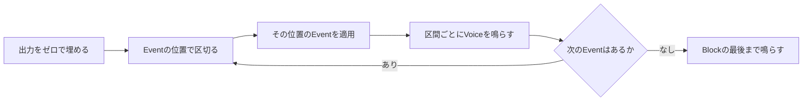
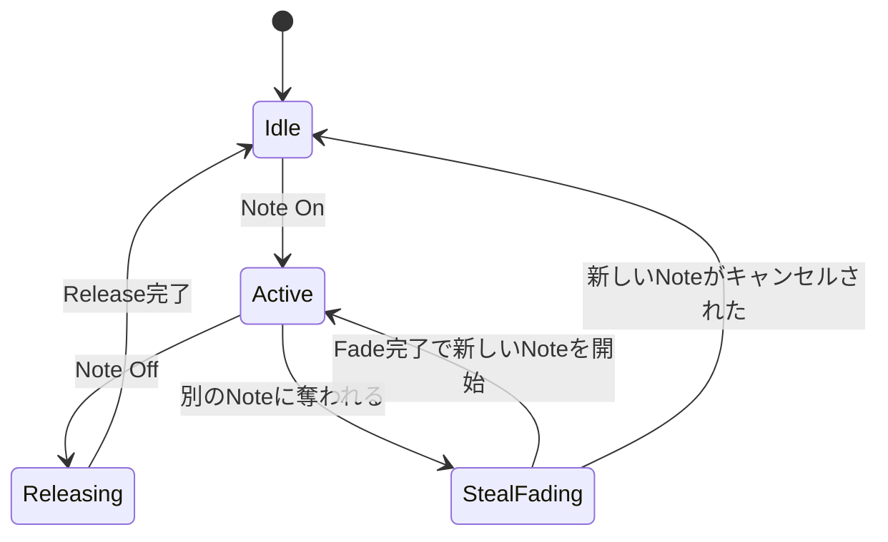
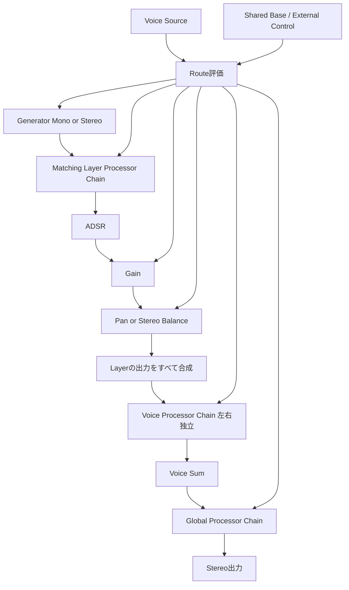
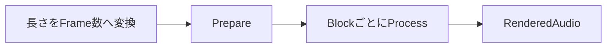

# 実行時の動作

## 本書の範囲

本書ではSonalloyの**実行時の動作**を説明します。1つのNoteが鳴って消えるまでの仕組み、1つのBlockの処理手順、Sampleの再生、準備とリセット、エラー時の扱いです。

| 本書で扱わない内容 | 参照先 |
|---|---|
| 部品の構造と所有関係 | `docs/architecture.md` |
| CLIの使い方・Option・Exit Code | `docs/cli.md` |
| Instrument Definition（JSON）の形式と制約 | `docs/instrument-definition.md` |

## 全体像

音源（Instrument Runtime）は、Polyphony数分のVoiceを固定で持っています。`process`を呼ばれるたびに、1つのBlock（最大Block SizeまでのSample列）を出力します。

1回の`process`は次の順で進みます。

- 出力はStereoで、左右のチャンネルを分けた`f32`バッファに書き込みます
- EventはNote、Parameter Change、Pitch Bend、Mod Wheel、Aftertouchを含みます。音の計算は毎Sample行われます
- Note OnからNote Offまでの間、そのNoteは1つのVoiceに割り当てられます

## Blockの処理

`process`に渡すものは、処理するFrame数、Blockの先頭位置（`absolute_frame`）、Event列、出力バッファです。EventはBlock内のSample位置（`sample_offset`）を持ち、その位置で正確に適用されます。

- 出力は先にゼロで埋めてから書き込みます。前のBlockの残りは混ざりません
- 区間ごとのRenderとEventの適用を繰り返し、最後にBlockの末尾まで鳴らします
- Frame数が0のBlockは、何もせず成功として扱います

**Eventの規則**

- Eventは`sample_offset`の昇順に並べます
- 同じ位置では`Note Off`、`Parameter Change`、`Pitch Bend`、`Mod Wheel`、`Aftertouch`、`Note On`の順に置きます
- 位置が前後している、または同じ位置の優先順位が不正な場合はエラーになります
- Parameter Handle、Normalized値、External Control値はBlock開始前に全件検証します。不正EventがあればStateを変更せず、対象Blockを無音にします

## Noteの一生

**Note On**

1. どのLayerもTrigger条件（Event / Key / Velocity）に合わないNoteは無視します
2. Voiceを1つ選びます。Idle → 最も音量の小さいReleasing → 最古のActive の順です
3. `note_on` Layerを開始し、`note_off` LayerをArmedにします。Armed LayerはAudioを生成せず、Note IDを保持します
4. 選んだVoiceがIdleなら即座にNoteを開始します。空きがない場合は、5msのFadeで古い音を消してから新しいNoteを開始します（Voice Stealing）

**Note Off**

- Note IDでVoiceを探し、Activeな`note_on` Layerを現在のADSR値からReleaseへ移行します
- Armedな`note_off` Layerは独立したEnvelopeのAttackから開始します。Armed Layerがある間は、Note On Layerが先に終了してもVoiceを保持します
- Voice Stealingの待機中だったNoteは、ここでキャンセルできます

**Voice Stealing**

- 古い音は5msで音量をゼロへFadeします。Fade中にNote Offが来たら、待機中の新しいNoteをキャンセルします
- Fadeが終わると待機していたNoteを開始し、Armed Stateを破棄します。演奏上のNote Offではないため、Steal中のArmed Layerは発音しません
- Active LayerとArmed Layerがすべて終わったらIdleへ戻ります

## Voiceの中身

Voiceは複数のLayer、Voice Source State、Layer Processor Chain、Voice Processor Chainを持ちます。Layerは「Generator + Layer Processor Chain + ADSR + Gain + Pan」のセットで、Trigger条件に合ったLayerだけが鳴ります。Base ParameterとInstrument ScopeのExternal Controlは全Voiceで共有し、LFO、Modulation Envelope、RandomはVoiceごとに保持します。Global Processor ChainはInstrument Runtimeが一つだけ所有します。

- **ADSR**：Note OnでAttackから始まり、Decayを経てSustainで待ちます。Note Offで現在の値からReleaseへ進みます。長さ0の区間は飛ばします
- **Gain**：Base値とRouteをdB Domainで加算し、RangeへClampした後にLinear Gainへ変換します。Note開始Fade、Amplitude ADSR、Dynamic Gainを順に乗算します
- **Pan**：Constant-powerで左右へ振り分けます
- **Tuning**：Base値とRouteをcentで加算し、OscillatorのFrequencyまたはSampleのPlayback Ratioへ変換します
- **Processor**：FilterはCutoffをLog2、ResonanceをLinearで評価して10msで滑らかに変化させます。Drive、Delay、ReverbのDynamic ParameterはDefinitionのTarget範囲でSmoothingします。Layer ProcessorはGenerator後、Voice ProcessorはLayer Mix後、Global ProcessorはVoice Sum後に適用します。Stereo GeneratorのLayer Filter / Driveは左右のStateを個別に持ちます
- **Global Tail**：Global DelayとReverbはActive Voiceがなくても毎Block処理されます。Note LifecycleやVoice StealingではGlobal ProcessorのStateを停止・初期化しません

## ParameterとModulation

Compiled InstrumentはParameter Catalog、Source Table、Target別Route Tableを持ちます。Process側はCatalogのDense Handleだけを使い、ID文字列を音声処理へ渡しません。

- Base ParameterはNormalized値をSmootherへ入れ、5ms（Filterは10ms、DelayとReverbはProcessor種別に応じた固定値）でTargetへ近づけます
- Routeは同じTargetについて書かれた順にSource値へAmountを掛けて加算します。Linear ParameterはNative範囲、Log2 ParameterはLog2範囲で加算し、最後にClampします
- Shared Parameter Spanは最大32Frame単位で全Voiceへ同じ値を渡します。Voice SourceはVoiceごとにSpanを計算します
- `velocity`、`key_tracking`、LFO、Modulation Envelope、RandomはVoiceに属します。Pitch Bend、Mod Wheel、Aftertouchは共有External Controlです
- Note OffはLayer ADSR、Operator Envelope、Modulation Envelopeへ伝えます。LFOとRandomはVoice終了まで保持し、Voice終了時に初期値へ戻します
- Instrument ResetではBase ParameterとExternal ControlもDefinition Defaultへ戻します

**Generatorの種類**

- **Oscillator**：Note番号とTuningから周波数を決め、Sine / Saw / Square / Triangle / Pulseを生成します。`phase_reset`が有効ならNoteごとにCompiled Initial Phaseへ戻し、TriangleのIntegrator Stateも初期化します。Pulse Widthは5msでSmoothingし、既存Modulationから制御できます。Hard SyncはVariable Shape BackendでMaster / Slaveを生成し、RatioをLog2で5ms Smoothingします。UnisonはPrepare時に固定したComponent数でDetune、Phase、Stereo Placementを行い、2 Voice以上をStereoで出力します。WaveshapingはUnison Mix直後にAmountをLinearで5ms Smoothingして適用します
- **Noise**：White / Pink / Brownを決定的なPRNG Streamから生成します。Shared、Left Independent、Right Independentの3 Streamを持ち、Correlationを`√correlation`と`√(1-correlation)`でMixして常にStereoで出力します
- **Wavetable**：Compile時にWAVをFrameへ分割し、FFT/IFFTでHarmonic上限の異なるBand Tableを準備します。PositionはFrame間をLinear、Table内をFour-point Cubicで補間し、Component Frequencyに応じたBandをLog2領域でCrossfadeします。Source Sample RateはPitchへ使わず、Unison 1ではMono、2 Voice以上ではStereoで出力します
- **Operator Modulation**：4 OperatorをCompile済みの固定Topology順にSampleごとに評価します。Phase、Frequency、Amplitude、Ringは同じOperator信号を使いながら別の相互作用として処理し、Carrier Sum後に`1 / sqrt(carrier_count)`で正規化します。Operator Envelopeは各Operator出力へ乗算し、Carrier以外のOperatorは接続先へのModulation Signalだけを供給します。Unison 1はMono、2〜4はComponentごとのPhaseとPrevious Outputを持つStereoです
- **Complex Oscillator**：Phase DistortionまたはOscillator Feedbackを含むDefinitionはRustのPhase-domain Sine Backendで処理します。Phase Distortionは`breakpoint = 0.5 - amount × 0.45`の連続Mapping、Feedbackは直前Sampleを`tanh(previous × amount × 2.5) × 0.25` cycleへ変換してRead Phaseへ加算します。Wavefoldは既存OscillatorのUnison MixとWaveshapingの後へDaisySP MIT版Wavefolderで適用し、AmountをDrive / Dry-Wetへ固定変換します。非線形機能の後へSample Rate依存のDC Blockerを置きます。Phase DistortionとFeedbackはSineだけで使用でき、Hard Syncとは併用できません
- **Sample**：後述のSample Zone選択と再生を使います。Compileで無効になったZoneは選択候補から除外されます

## Wavetable Runtime

Prepared WavetableはCompile時に`Arc`でCompiled Instrumentへ保持し、全Voiceで共有します。Voiceごとに保持するのはUnison ComponentごとのPhaseだけです。Assetが準備できなかったLayerはNote OnのSelectionから除外され、Runtimeへ到達した場合はInvalid State Errorになります。

- Frame Positionは`position × (frame_count - 1)`で求め、隣接FrameをLinear Interpolationします。PositionはParameter Spanの各Sample値を使います
- Table PositionはPhaseから求め、`[last, sample0 ... sampleN-1, sample0, sample1]`のGuard付きTableをFour-point Cubicで読み出します
- ComponentごとにBase Frequency、Unison Detune、Layer Tuningを適用し、`sample_rate × 0.45`へClampします。Band選択もComponent Frequencyごとに行います
- Band Tableは`N/2, N/4, ..., 1`のHarmonic上限を持ち、隣接Bandの切替をLog2領域でCrossfadeします。DCはCompile時のSource値を保持します
- Note Onでは`phase_reset`が有効な場合だけInitial Phaseへ戻し、Instrument Resetでは常にInitial Phaseへ戻します
- Process中はAsset Decode、FFT、File I/O、メモリ確保を行いません

## Operator Modulation Runtime

Operatorの`evaluation_order`、`incoming_masks`、`carrier_mask`はCompile時に確定し、RuntimeはAlgorithm名を参照しません。各Sampleでは、依存するModulatorのCurrent Outputと対象Operator自身のPrevious Outputだけを読みます。Operator間の任意Cycleはなく、Self Feedbackだけが一Sample遅延を持ちます。

- Operator Frequencyは`note_frequency × ratio × cents_to_ratio(layer_tuning + detune + unison_detune)`で作り、Phase / Frequencyは`sample_rate × 0.24`、Amplitude / Ringは`sample_rate × 0.45`以下へ制限します
- Phaseは`Σ(modulator_output × modulation_amount × 0.5)`をRead Phaseへ加えます。Frequencyは`base_frequency × (1 + Σ(modulator_output × modulation_amount) + feedback_offset)`を瞬時周波数とし、正負を許可したまま絶対値を上限へClampします
- AmplitudeはIncomingごとに`1 + modulator_output × depth`を乗算し、0〜4へClampします。Ringは`carrier + (carrier × modulator_output - carrier) × depth`をIncoming順に適用します
- Feedbackは直前Sampleの自身の出力を`tanh(previous × amount × 2.5) × 0.25`へ変換し、PhaseまたはFrequencyへ加えます。Finite確認とReset時の0初期化を行い、Feedback SignalをCarrier Sumへ直接加算しません
- Note Onで4つのOperator Envelopeを開始し、Note Offで4つをReleaseへ移行します。Voice Stealingで新しいNoteを開始するとEnvelopeとPrevious Outputを新しいNoteの状態へ戻します
- Operator UnisonはEnvelopeを全Componentで共有し、ComponentごとにPhaseとPrevious Outputを分離します。Carrier Sum後の各ComponentをStereo Spreadへ通し、Component数の平方根で正規化します
- Process中の配列拡張やHeap Allocationは行いません。OperatorのComponent配列とEnvelopeはPrepare時に確保します

## Sampleの再生

SampleはCompile時にZoneごとのRegion、Direction、Loopへ変換し、同じAssetのPrepared Audioを全Voiceで共有します。Prepared AudioはMonoまたはStereoのPlanar Channelを保持します。Voiceごとに選択Zone、再生位置（Cursor）、Loop状態だけを持ち、Reverse用の複製Bufferは作りません。

- Layer Trigger判定後、NoteとVelocityに一致するZoneを選択します。同じ条件のRound Robin GroupはInstrument単位のCounterをDefinition順に進めます。Voice StealingでNote開始が遅れても、Note Event時点のZone選択を保持します
- Regionは`[start, end)`で、Compile時にPrepared Frameへ変換します。Endを省略するとAsset終端になります
- `forward`はRegion StartからEndへ、`reverse`はRegion End側のFrameからStartへCursorを進めます。再生速度は`2^((note - root) / 12) × Tuning Ratio`です。Tuning RatioはParameter SpanのStart / EndからLog Domainで補間します
- Cursorは再生速度で進み、左右を同じCursorで4点Cubic補間します。Monoは左右へ同じ値を渡し、Stereoは左右のChannelを保持します
- Region外を補間へ参照しません。LoopなしではRegion末尾（Reverseでは先頭）の5msをゼロへFadeし、音が急に切れないようにします
- LoopはRegion内に置き、ForwardではLoop EndからLoop Startへ、ReverseではLoop StartからLoop End側へ戻ります。Fractional Overshootは`rem_euclid`で保持し、Loop境界の補間はLoop Region内だけを参照します
- `crossfade_seconds`が0より大きいLoopは、境界付近でLoop終端側と開始側をConstant-powerでBlendします。Crossfade Frame数はCompile時に確定し、Loop長の半分を超える設定は拒否します
- Note OffではPlayback Cursorを止めず、ActiveなLayerのADSR Releaseを進めます。`note_off` LayerはArmed状態からAttackを開始し、EnvelopeとSampleが終わるまでVoiceを保持します

## 準備とリセット

- **Prepare**：Polyphony数分のVoiceを作り、Block Scratch、Note On Selection Scratch、Pending Note Selection Buffer、Native Handleを確保します。Sample RateがCompile時と一致しない場合は失敗します。Block Sizeの変更だけは許されます
- **Reset**：全Voice、OscillatorとOperatorの位相、Operator Previous Output、TriangleのIntegrator State、Noise Stream、Sampleの選択Zone / Cursor / Loop状態、Round Robin Counter、ADSR、Operator Envelope、Voice Source、Layer Processor、Voice Processor、Global Processor、Base Parameter、External Control、Scratch、絶対位置を最初の状態へ戻します。Reset後は同じ入力に対して同じ出力になります
- Prepareに失敗した場合は、それまでの状態を破棄して利用できない状態にします
- ProcessまたはReset中にNative DSP処理が失敗した場合は、出力を無音化してErrorを返し、Runtimeを未準備状態へ移行します。再利用にはPrepareが必要です

Oscillatorの信号順序は、Component生成、Unison Mix / Stereo Placement、Generator Waveshaping、必要なWavefolder、必要なDC Blocker、Layer Processor Chainです。Unisonの各Componentは同じDefinitionから独立したNative Stateを持ち、`1 / sqrt(voices)`で正規化します。Basic TriangleのPolyBLEPとIntegrator StateはNative Wrapperが所有します。Hard SyncのResetはNative WrapperでVariable Shape Oscillatorを再初期化し、Waveform ShapeとSync設定を復元します。Phase-domain ComponentはPhaseとPrevious OutputをComponentごとに保持し、WavefolderはMonoでは1つ、Stereoでは左右独立のHandleを使用します。

## Sine Runtime（開発用）

- `dev render-sine`で使う単音のRuntimeです。Voiceの仕組みはなく、Event列を受け取るとエラーになります
- Prepareで周波数を検証し（Nyquist以下）、Native Oscillatorで生成した同じ信号を左右へコピーします

## 約束事

**Process中にしてはいけないこと**

- JSONの解析、ファイルの読み書き、素材の読み込み・Sample Rate変換・Hash計算
- メモリの新規確保
- 通信、同期型のログ出力、ブロックする待ち合わせ

**エラー時の扱い**

- 不正な入力や位置のずれ（Context不一致）はエラーにし、そのBlockの出力は無音にします
- Native側の失敗は`ProcessError::DspFailure`、Rust Processor側の失敗は`ProcessError::ProcessorFailure`へ変換します
- エラーとExit Codeの対応は`docs/cli.md`を参照してください

## 書き出し（Offline Render）

ファイルへの書き出しは、CoreのRendererが同じProcessをBlock単位で繰り返します。

- 長さは「秒 × Sample Rate」を最も近い整数に丸め、TailのFrame数を足します
- 最後のBlockは残りのFrame数だけを処理するので、余分なSampleはできません
- Coreは`RenderedAudio`（左右のSample列）を返し、WAVへの変換はCLI側の仕事です
