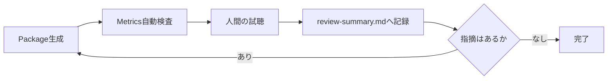

# Testing and Sound Review

## 本書の範囲

本書はSonalloyの**検証プロセス**を定義します。Testの配置と記述ルール、Native境界の検証、音声Reviewのルールと流れです。

| 本書に書かないこと | 参照先 |
|---|---|
| 個々のReview結果の記録 | `review-output/*/review-summary.md` |
| Review Scriptの責務 | `scripts/review/README.md` |
| 製品仕様 | `docs/architecture.md` ほか |

## テスト配置

| 対象 | 場所 |
|---|---|
| Moduleの内部契約 | 実装と同じ`src/`のUnit Test |
| CrateのPublic API経路 | 対象Crateの`tests/`のIntegration Test |
| Workspace直下 | Testを置かない |
| 複数Testで共有する期待値 | `testdata/expected/` |

## テスト記述ルール

- 1つのTestで1つの振る舞いを検証する
- 実装の内部構造ではなく、公開された結果・Error・状態遷移を検証する
- 時刻・乱数・外部Service・音声Deviceに依存しない
- Native境界の故障経路はTest用故障注入で検証する（通常のBuildには含めない）

## Native境界の検証

- C++からRustへ例外を越境させず、Result Codeへ変換する
- Native Error時は出力Bufferを無音化し、Error・Buffer長・所有権・Destroy・Resetを検証する
- Guard付きTestでProcess領域外が変更されていないことを確認する
- Native境界を含むTestはLinux CIでASan / UBSan / Leak検出の対象にする
- Signalsmith Stretch境界ではMono / Stereo、Pitch、入力・出力Latency、無効なHandle・Buffer、Native故障時の無音化を検証する
- Stretchを使用するRuntimeではPrepare後のProcessが追加Allocationを発生させず、Reset後に同じ出力を生成することを検証する

## Dynamic Parameterの検証

Dynamic Parameterを追加・変更した場合は、次の観点をUnit TestまたはIntegration Testで検証します。

- Parameter IDの重複、未知のTarget、未知のSource、Range違反がCompile時に診断される
- Parameter Change、Pitch Bend、Mod Wheel、Aftertouchが絶対Frame位置へ反映され、同一Offsetのイベントが優先順位どおりに処理される
- Layer Gain / Pan / Tuning、Layer / Voice / Global Processor ParameterがTargetのUnitとRangeへ変換され、Routeの加算後にClampされる
- LFO、Modulation Envelope、Random、Velocity、Key TrackingのSourceが同じDefinitionとEventから決定的に再現される
- Block Sizeを変更してもSourceの時間軸、Event位置、出力のFinite性が変わらない
- Reset後の出力が初回Renderと一致し、Voice Stealing後も新旧VoiceのParameter Stateが混ざらない
- Span内で実効値が変化しないTargetは通常のDSP処理を使い、変化するOscillator / Filter TargetだけRamp処理を使う
- MIDIのControl Channel統合警告とNote Event必須条件がCLI経路で検証される
- NativeのOscillator / Filter Rampが有効なBuffer境界を守り、故障時に無音化とError伝播を行う

Testは時刻、外部MIDI Device、OS依存の乱数、ファイル更新時刻に依存させず、乱数SeedとEvent Sequenceを固定します。公開経路は`tests/`、内部計算は実装Module内のUnit Testへ置きます。

## 音声Review

- Metricsは`scripts/review/measure_wav.py`でWAVから生成する（手入力しない）
- 自動Testの期待値は`testdata/expected/sine_metrics.json`で管理する
- Metrics合格は音質合格ではない。最終判断は人間が試聴して行う

## Review Package

### Basic Poly Synth

- 保存先：`review-output/basic-poly-synth/`（audio / definitions / midi / metrics.json / review-summary.md）
- 生成：`python scripts/review/generate_basic_poly_synth_package.py`
- Metrics：Finite性、Peak / RMS / DC、推定周波数、隣接Frame差分、Block Size 64 / 257 / 1024での再現比較
- 人間の確認：Saw高音域、Note境界、Attack/Release、同音連打、Voice Stealing、Filter/Velocity、楽曲での実用性

### Metallic Hybrid

- 保存先：`review-output/metallic-hybrid/`（audio / definitions / midi / assets / metrics.json / review-summary.md）
- 生成：`python scripts/review/generate_metallic_hybrid_package.py`
- Metrics：Basicと同じ内容に加え、Sample Layerの有効状態、AssetのSHA-256一致、Sample-onlyの非無音性、Hybrid MixとOscillator-onlyの差分を検査
- 人間の確認：原音との差、Pitch品質、Sample終端のClick、Attackの初速、Bodyの芯と余韻、SoloとMixの一体感、Velocityの自然さ、Phraseでの実用性

### Dynamic Parameters

- 保存先：`review-output/dynamic-parameters/`（audio / definitions / events / midi / metrics.json / review-summary.md）
- 生成：`python scripts/review/generate_dynamic_parameters_package.py`
- 内容：`render events`と`render midi`で同じDefinitionを固定EventへRenderする。Parameter Change、LFO、Modulation Envelope、Random Pan、External Control、Voice Stealing、Key Tracking、Resonance、Phraseを個別の音源で確認する
- Metrics：Finite性、Peak / RMS / DC、Parameter Change前後のFrame差分、Block Size 32 / 64 / 257 / 1024の出力比較、Random Seed再現性、Pitch Bendの連続性
- 人間の確認：LFOの周期と位相、EnvelopeのAttack / Decay / Sustain / Release、Velocityの音量変化、Key Trackingの音域変化、Random Panの左右定位、Pitch Bendの滑らかさ、Mod Wheel / AftertouchによるFilter・Gain変化、Resonanceの安定性、Voice Stealing、Parameter ChangeのClick、OscillatorとSampleの音程一致

### Processor Chain

- 保存先：`review-output/processor-chain/`（audio / definitions / events / midi / assets / metrics.json / review-summary.md）
- 生成：`python scripts/review/generate_processor_chain_package.py`
- 内容：Layer Filter / Drive、Voice Filter / Drive、Global Delay / Reverb、Parameter Change、Global Mod Wheel、Voice Stealing、Reset、Block Size、Sample Rateを同一仕様で確認する
- Metrics：Finite性、Peak / RMS / DC、Delay Echo位置、Delay Echo Energy、Reverb Tail、Stereo差分、Block Size差分、Reset差分、Baseline差分
- 人間の確認：Layer単位の作用範囲、Driveの質感とAliasing、Delayの間隔・Feedback・定位、Reverbの初期反射・Tail・Damping・Width、Processed Hybridの原音とのバランス、曲での実用性

### Basic Generator

- 保存先：`review-output/basic-generators/`（audio/technical / definitions / events / metrics.json / review-summary.md）
- 生成：`python scripts/review/generate_basic_generators_package.py`
- 内容：Band-limited Square / Triangle / Pulse、Pulse Width、既存LFOによるPWM、White / Pink / Brown Noise、Stereo Correlationを同じDefinitionと固定Eventから確認する
- Metrics：Finite性、Peak / RMS / DC、推定周波数、隣接Frame差分、固定長Spectrum、Sample Rate 44.1 / 48 / 96 kHz、Block Size 32 / 64 / 257 / 1024での出力比較、新規Runtime間の再現性
- 人間の確認：波形間の音色差、高音域のAlias、Pulse Widthの差、PWMのClick、Noise色の差と周期性、Brownの低域偏り、Stereo Correlationの幅、新規Runtime間のNoise冒頭一致
- `audio/technical/`の生出力をMetricsと人間の試聴で共用し、試聴専用の正規化コピーはReview Packageへ保存しない。聴感比較時の音量は再生側で調整する

### Harmonic / Formant Synthesis

- 保存先：`review-output/harmonic-formant-synthesis/`（audio/technical / audio/performance / definitions / events / midi / assets / `additive-inspect.json` / `inspect.json` / `hybrid-inspect.json` / metrics.json / review-summary.md）
- 生成：`python scripts/review/generate_harmonic_formant_package.py`
- 内容：AdditiveのSingle Fundamental、Harmonic Organ、Fractional Ratio、Spectrum A / B、Morph、Tilt、Inharmonicity、Partial Envelope、High-note Alias Fade、16-note Polyphony、Formantの5 Vowel Profile、Vowel Position、Formant Shift、Throat、Spectral Tilt、Vowel Position LFO、High-note Alias Fade、Formant + Noise Texture、HybridのLayer Mix、Processor、Modulation、Events、MIDI Renderを一つのPackageへ保存する
- Performance：Release BuildでAdditiveの1 / 16 / 32 / 64 Partial × 1 / 4 / 8 / 16 Voice、Formantの32 / 64 Partial × 1 / 5 / 8 Profile、64 Partial × 5 Profile × 16 Voiceを2秒Renderし、Audio Duration、Elapsed Time、`elapsed / audio_duration`、Work Units、Finite性、Peak、RMS、相対Realtime比を`metrics.json`へ記録する。絶対的な合格閾値は設けず、Partial / Voice / Profileに対する増加傾向を確認する
- Metrics：Sine TableのLength / Guard / Lookup最大絶対誤差、Finite性、Peak / RMS / DC、単音Spectrum、Profile差分、Parameter差分、Hybrid Control差分、Sample Rate 44.1 / 48 / 96 kHz、Block Size 32 / 64 / 257 / 1024、Fresh Runtime再現性、High-note高域Energy、既存Reference DefinitionのValidateと代表Render
- 自動確認：1〜64 Partial、1〜8 Profile、各5 Band、Parameter Descriptor、Partial EnvelopeのLifecycle、Profile Morph、Formant Shiftで基音Pitchを維持すること、Throat / Tilt、4 Generator Layer、Processor Chain、Route Target、MIDI出力、既存のBasic / Sample / Processor / Essential / Granular / Wave Sequence / Digital Referenceの回帰、性能計測の全CaseのFinite性と非無音性
- 人間の確認：基音と整数倍Partialの明瞭さ、Inharmonic Bellの金属感、Additive Morph / Tilt / Inharmonicity / Partial Envelope、高音域AliasのFade、各Vowelの共鳴位置、Vowel Morphの連続性、Formant Shiftで基音が変わらないこと、Throat、Spectral Tilt、Vowel Position LFO、Noise Texture、Sample Attack、Layer / Voice / Global Processor、Delay / Reverb Tail、MIDI Phrase、Polyphony、Voice Stealing、Reset後の発音
- `audio/technical/`と`audio/performance/`の生出力をMetricsと人間の試聴で共用し、試聴専用の正規化コピーはReview Packageへ保存しない。聴感比較時の音量は再生側で調整する

### Digital Synthesis

- 保存先：`review-output/digital-synthesis/`（assets / audio/technical / definitions / events / midi / `inspect.json` / `operator-inspect.json` / `complex-inspect.json` / `complex-phase-inspect.json` / `digital-hybrid-inspect.json` / metrics.json / review-summary.md）
- 生成：Windowsでは`py -3 scripts/review/generate_digital_synthesis_package.py`、それ以外では`python3 scripts/review/generate_digital_synthesis_package.py`
- 内容：Wavetable 1〜10、4 Operator Modulation 11〜23、Complex Oscillator 24〜35、Wavetable Motion Bass / FM Bell / Phase Distortion Lead / Digital Hybrid Lead / Digital Hybrid Phrase 36〜40を同じCLI経路から確認する
- Metrics：全40音源のFinite性、Peak / RMS / DC、単音RenderではMIDI Noteから算出したFundamental、複数音RenderではZero Crossing補助値、基準周波数が成立する単音RenderのSpectrum / Spectral Centroid / Harmonic・Non-harmonic Energy参考値、Stereo差分、Adjacent Frame差分、Parameter Sweep境界差分、Sample Rate 44.1 / 48 / 96 kHz、Block Size 32 / 64 / 257 / 1024、Fresh Runtime / Reset、Prepared Wavetable Byte数、Operator / Complexの性能値
- 自動確認：Definition Validate、Inspect JSON、Wavetable Layout / Missing Asset診断、Operator topology / Allocation 0 / Reset、Native Wavefolderの有限値境界、Digital Hybrid 3レイヤーValidate・Events / MIDI Render
- 人間の確認：Frame / Position、Band切替、高音域Alias、PM / FM / AM / Ring、Algorithm、Envelope、Feedback、Phase Distortion、Wavefold、Unison、Polyphony、Digital Hybridの音色成立
- `audio/technical/`の生出力をMetricsと人間の試聴で共用し、試聴専用の正規化コピーはReview Packageへ保存しない。聴感比較時の音量は再生側で調整する

### Spectral Resynthesis

- Metrics：Periodic Hannの端点、4倍Overlap-addのWindow正規化、非Bin中心周波数のInstantaneous Frequency、FFT Roundtrip、Identity ResynthesisのSNR、Reported Latency、Block Size 32 / 64 / 257 / 1024、Mono / Stereo Channelの保持、Prepared Bytesを検査する
- 自動確認：DefinitionのField Rangeと`asset_b`によるMorph Parameterの登録、1024 / 2048 / 4096 FFT、Missing Asset診断、Source Metadata、Spectral Frame数、FFT / Hop / Bin数、Parameter Descriptor、Latency、Render結果のFinite性を確認する
- 人間の確認：元WAVとの音色・Transient・Noise Floorの一致、Latency後の時間位置、Mono / Stereoの定位、FFT Size変更による品質とCPU負荷を確認する
- Process中はAsset Decode、File I/O、FFT Plan生成、Heap拡張を行わない。Sound Review用のWAVは`review-output/`へ保存し、Repositoryへ生成物を追加しない

### Essential Synthesis and Sampling

- 保存先：`review-output/essential-synthesis-sampling/`（audio/technical / definitions / events / midi / assets / inspect.json / metrics.json / review-summary.md）
- 生成：`python scripts/review/generate_essential_synthesis_sampling_package.py`
- 内容：Key Zone、Velocity Layer、Round Robin、Stereo Sample、Forward / Reverse Playback、通常Loop、Constant-power Crossfade Loop、Explicit Slice、Release Trigger、Mapped Sample Instrument、Essential Hybrid Instrument、Fixed Stretch、Tempo Sync、Block Size、Sample Rate、再Render、Voice Stealingを同じDefinitionと固定Eventから確認する
- Metrics：Finite性、Peak / RMS / DC、左右Channelの分離、隣接Frame差分、Sample Rate別値、Block Size比較、再RenderSHA、Round Robin選択順、Forward / ReverseのRegion境界、Loop周期、Crossfade境界、Slice Region長、Release LayerのArmed期間、Asset Cacheの共有数、StretchのMeasured Latency、Tempo SyncのBPM別継続時間とPitch一致、Stretch Layerと非Stretch Layerの発音位置一致
- 人間の確認：Key / Velocity境界、Pitch Mapping、Round Robin順、Stereo Image、Reverseの方向感、Loopの周期とClick、Crossfadeの連続性、Release Triggerの発音タイミング、Release中の挙動、Slice範囲、Fixed StretchのPitch保持、Tempo SyncのBPM変化とPitch保持、Stretch Layerと非Stretch LayerのAlignment、Missing Asset時の継続、Pending Note、Hybrid音色としての成立
- `audio/technical/`の生出力をMetricsと人間の試聴で共用し、試聴専用の正規化コピーはReview Packageへ保存しない。聴感比較時の音量は再生側で調整する

### Granular Generator

- 保存先：`review-output/granular-generator/`（audio/technical / definitions / events / assets / inspect.json / metrics.json / review-summary.md）
- 生成：`python scripts/review/generate_granular_package.py`
- 内容：Granular Pad、Vocal Freeze、Percussion Cloud、Position Scrub、Stereo Source、Polyphonyを同じCLI経路から確認する
- Metrics：Finite性、Peak / RMS / DC、Stereo差分、Position / Grain Size / Density / Pitch / Randomness / Pan Spreadの出力差分、Seed再現性、Block Size 32 / 64 / 257 / 1024、Sample Rate 44.1 / 48 / 96 kHz、固定Pool上限
- 自動確認：Definition Validate、Inspect JSON、6つのParameter Descriptor、Prepared Region、64 Slot Pool、Block Size再現、Sample Rate再生、Seed再現、Scrub / Freezeの非無音性、Stereo Sourceの左右保持、Mono AssetのStereo出力、Polyphonyの有限性。Hann Windowの境界値とProcess中Allocation 0はCore Testで確認する
- 人間の確認：Grain開始・終了のClick、Densityによる密度感、Grain Sizeの質感、Pitchの変化、Randomnessの空間的な広がり、Pan SpreadのStereo幅、Scrubの追従、Freezeの持続性、Vocal Textureの明瞭さ、Percussion CloudのTransient、Polyphony時の音量と実用性
- `audio/technical/`の生出力をMetricsと人間の試聴で共用し、試聴専用の正規化コピーはReview Packageへ保存しない。聴感比較時の音量は再生側で調整する

### Wave Sequence

- 保存先：`review-output/wave-sequence/`（audio/technical / definitions / events / assets / `inspect.json` / `hybrid-inspect.json` / metrics.json / review-summary.md）
- 生成：`python scripts/review/generate_wave_sequence_package.py`
- 内容：Single Step、Forward、Reverse、Ping Pong、Sequence Loop、One-shot Step、Loop Step、Seconds / Beats Duration、Tempo Change、Crossfade、Step Pitch / Gain、Missing Step、All Missing、Stereo / Mono混在、Reset、Wave Sequence Hybridを同じCLI経路から確認する
- Metrics：Finite性、Peak / RMS / DC、Step境界、Crossfade境界、Block Size 64 / 257 / 1024、Sample Rate 44.1 / 48 / 96 kHz、Tempo Change後のStep位置、Pitch / Gain差分、Missing StepのTiming保持、All Missing Layerの無効化、Stereo分離、Reset再現性
- 自動確認：Definition Validate、Wave Sequence Inspect、4 Step以上のStep Count、Direction / Loop / Crossfade、Duration Type、Playback Direction、Step Availability、Block Size比較、Sample Rate生成、Tempo Map、HybridのWavetable / Granular / Wave Sequence / Sample / Release Layer、Voice Filter / Drive、Global Delay / Reverb
- 人間の確認：Forward / Reverse / Ping Pongの順序、端Stepの重複有無、One-shot終端の無音、Loopの境界、Constant-power Crossfade、Step Pitch / Gain、Missing Stepの無音区間、Mono / Stereoの定位、Tempo Change、Reset後の同一性、Voice / Global Processorを含むHybrid音色としての成立
- `audio/technical/`の生出力をMetricsと人間の試聴で共用し、試聴専用の正規化コピーはReview Packageへ保存しない。聴感比較時の音量は再生側で調整する

試聴の際は同じ再生環境・音量で比較し、確認結果を`review-summary.md`へ記録します。
