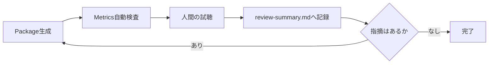

# Testing and Sound Review

## 本書の範囲

本書はSonalloyの**検証プロセス**を定義します。Testの配置と記述ルール、Native境界の検証、音声Reviewのルールと流れです。

| 本書に書かないこと | 参照先 |
|---|---|
| 個々のReview結果の記録 | `review-output/*/review-summary.md` |
| Review Scriptの責務 | `scripts/review/README.md` |
| 製品仕様 | `docs/architecture.md` ほか |

## テスト配置

| 対象 | 場所 |
|---|---|
| Moduleの内部契約 | 実装と同じ`src/`のUnit Test |
| CrateのPublic API経路 | 対象Crateの`tests/`のIntegration Test |
| Workspace直下 | Testを置かない |
| 複数Testで共有する期待値 | `testdata/expected/` |

## テスト記述ルール

- 1つのTestで1つの振る舞いを検証する
- 実装の内部構造ではなく、公開された結果・Error・状態遷移を検証する
- 時刻・乱数・外部Service・音声Deviceに依存しない
- Native境界の故障経路はTest用故障注入で検証する（通常のBuildには含めない）

## Native境界の検証

- C++からRustへ例外を越境させず、Result Codeへ変換する
- Native Error時は出力Bufferを無音化し、Error・Buffer長・所有権・Destroy・Resetを検証する
- Guard付きTestでProcess領域外が変更されていないことを確認する
- Native境界を含むTestはLinux CIでASan / UBSan / Leak検出の対象にする

## Dynamic Parameterの検証

Dynamic Parameterを追加・変更した場合は、次の観点をUnit TestまたはIntegration Testで検証します。

- Parameter IDの重複、未知のTarget、未知のSource、Range違反がCompile時に診断される
- Parameter Change、Pitch Bend、Mod Wheel、Aftertouchが絶対Frame位置へ反映され、同一Offsetのイベントが優先順位どおりに処理される
- Layer Gain / Pan / Tuning、Layer / Voice / Global Processor ParameterがTargetのUnitとRangeへ変換され、Routeの加算後にClampされる
- LFO、Modulation Envelope、Random、Velocity、Key TrackingのSourceが同じDefinitionとEventから決定的に再現される
- Block Sizeを変更してもSourceの時間軸、Event位置、出力のFinite性が変わらない
- Reset後の出力が初回Renderと一致し、Voice Stealing後も新旧VoiceのParameter Stateが混ざらない
- Span内で実効値が変化しないTargetは通常のDSP処理を使い、変化するOscillator / Filter TargetだけRamp処理を使う
- MIDIのControl Channel統合警告とNote Event必須条件がCLI経路で検証される
- NativeのOscillator / Filter Rampが有効なBuffer境界を守り、故障時に無音化とError伝播を行う

Testは時刻、外部MIDI Device、OS依存の乱数、ファイル更新時刻に依存させず、乱数SeedとEvent Sequenceを固定します。公開経路は`tests/`、内部計算は実装Module内のUnit Testへ置きます。

## 音声Review

- Metricsは`scripts/review/measure_wav.py`でWAVから生成する（手入力しない）
- 自動Testの期待値は`testdata/expected/sine_metrics.json`で管理する
- Metrics合格は音質合格ではない。最終判断は人間が試聴して行う

## Review Package

### Basic Poly Synth

- 保存先：`review-output/basic-poly-synth/`（audio / definitions / midi / metrics.json / review-summary.md）
- 生成：`python scripts/review/generate_basic_poly_synth_package.py`
- Metrics：Finite性、Peak / RMS / DC、推定周波数、隣接Frame差分、Block Size 64 / 257 / 1024での再現比較
- 人間の確認：Saw高音域、Note境界、Attack/Release、同音連打、Voice Stealing、Filter/Velocity、楽曲での実用性

### Metallic Hybrid

- 保存先：`review-output/metallic-hybrid/`（audio / definitions / midi / assets / metrics.json / review-summary.md）
- 生成：`python scripts/review/generate_metallic_hybrid_package.py`
- Metrics：Basicと同じ内容に加え、Sample Layerの有効状態、AssetのSHA-256一致、Sample-onlyの非無音性、Hybrid MixとOscillator-onlyの差分を検査
- 人間の確認：原音との差、Pitch品質、Sample終端のClick、Attackの初速、Bodyの芯と余韻、SoloとMixの一体感、Velocityの自然さ、Phraseでの実用性

### Dynamic Parameters

- 保存先：`review-output/dynamic-parameters/`（audio / definitions / events / midi / metrics.json / review-summary.md）
- 生成：`python scripts/review/generate_dynamic_parameters_package.py`
- 内容：`render events`と`render midi`で同じDefinitionを固定EventへRenderする。Parameter Change、LFO、Modulation Envelope、Random Pan、External Control、Voice Stealing、Key Tracking、Resonance、Phraseを個別の音源で確認する
- Metrics：Finite性、Peak / RMS / DC、Parameter Change前後のFrame差分、Block Size 32 / 64 / 257 / 1024の出力比較、Random Seed再現性、Pitch Bendの連続性
- 人間の確認：LFOの周期と位相、EnvelopeのAttack / Decay / Sustain / Release、Velocityの音量変化、Key Trackingの音域変化、Random Panの左右定位、Pitch Bendの滑らかさ、Mod Wheel / AftertouchによるFilter・Gain変化、Resonanceの安定性、Voice Stealing、Parameter ChangeのClick、OscillatorとSampleの音程一致

### Processor Chain

- 保存先：`review-output/processor-chain/`（audio / definitions / events / midi / assets / metrics.json / review-summary.md）
- 生成：`python scripts/review/generate_processor_chain_package.py`
- 内容：Layer Filter / Drive、Voice Filter / Drive、Global Delay / Reverb、Parameter Change、Global Mod Wheel、Voice Stealing、Reset、Block Size、Sample Rateを同一仕様で確認する
- Metrics：Finite性、Peak / RMS / DC、Delay Echo位置、Delay Echo Energy、Reverb Tail、Stereo差分、Block Size差分、Reset差分、Baseline差分
- 人間の確認：Layer単位の作用範囲、Driveの質感とAliasing、Delayの間隔・Feedback・定位、Reverbの初期反射・Tail・Damping・Width、Processed Hybridの原音とのバランス、曲での実用性

### Basic Generator

- 保存先：`review-output/basic-generators/`（audio/technical / definitions / events / metrics.json / review-summary.md）
- 生成：`python scripts/review/generate_basic_generators_package.py`
- 内容：Band-limited Square / Triangle / Pulse、Pulse Width、既存LFOによるPWM、White / Pink / Brown Noise、Stereo Correlationを同じDefinitionと固定Eventから確認する
- Metrics：Finite性、Peak / RMS / DC、推定周波数、隣接Frame差分、固定長Spectrum、Sample Rate 44.1 / 48 / 96 kHz、Block Size 32 / 64 / 257 / 1024での出力比較、新規Runtime間の再現性
- 人間の確認：波形間の音色差、高音域のAlias、Pulse Widthの差、PWMのClick、Noise色の差と周期性、Brownの低域偏り、Stereo Correlationの幅、新規Runtime間のNoise冒頭一致
- `audio/technical/`の生出力をMetricsと人間の試聴で共用し、試聴専用の正規化コピーはReview Packageへ保存しない。聴感比較時の音量は再生側で調整する

### Complex Oscillator

- 保存先：`review-output/complex-oscillator/`（audio/technical / definitions / events / inspect.json / metrics.json / review-summary.md）
- 生成：`python scripts/review/generate_complex_oscillator_package.py`
- 内容：Hard Sync Ratio 2 / 6、Ratio Sweep、Waveshaping Amount 0.5 / Sweep、Unison 3 / 5 / 8、Hard Sync + Unison、Essential Synth Referenceを同じDefinitionと固定Eventから確認する
- Metrics：Finite性、Peak / RMS / DC、固定長Spectrum、Stereo差分、Stereo Correlation、Sample Rate 44.1 / 48 / 96 kHz、Block Size 32 / 64 / 257 / 1024での出力比較、新規Runtime間の再現性、同時発音Polyphony / Unison別のCLI Render時間とピークWorking Set。性能値はCLI込みの参考値として扱い、Runtime単体のRealtime性能とは分ける
- 人間の確認：Ratio別の倍音、Ratio SweepのPitch連続性、高音域Hard SyncのAlias、Waveshapingの倍音変化とClick、UnisonのBeat・Stereo幅・Mono互換性、Voice数増加時のLevel、Hard Sync + Unison、Bass / Lead / Pad用途
- `audio/technical/`の生出力をMetricsと人間の試聴で共用し、試聴専用の正規化コピーはReview Packageへ保存しない。聴感比較時の音量は再生側で調整する

### Wavetable

- 保存先：`review-output/digital-synthesis/`（assets / audio/technical / definitions / events / inspect.json / operator-inspect.json / missing-asset-inspect.json / layout-error.json / metrics.json / review-summary.md）
- 生成：`python scripts/review/generate_digital_synthesis_package.py`
- 内容：単一Frame、Position 0 / 0.5 / 1、Position Sweep、Position LFO、Unison 5 Stereo、Band Boundary Sweep、Missing Assetと既存Oscillator Layerの継続を同じ入力条件で確認する
- Metrics：Finite性、Peak / RMS / DC、推定Fundamental、Spectrum、Stereo差分、Adjacent Frame最大差分、Band Boundary差分、Block Size 32 / 64 / 257 / 1024、Sample Rate 44.1 / 48 / 96 kHz、Fresh Runtime / Reset差分、Prepared Wavetable Byte数
- 人間の確認：Frameごとの音色差、Position Sweepの滑らかさ、Band切替の不連続、高音域Alias、低音域の倍音、UnisonのBeatとStereo幅、Mono再生時のLevel、Bass用途での成立
- `audio/technical/`の生出力をMetricsと人間の試聴で共用し、試聴専用の正規化コピーはReview Packageへ保存しない。聴感比較時の音量は再生側で調整する

### Operator Modulation

- 保存先：`review-output/digital-synthesis/`（Operator Definition / Event / WAV / `operator-inspect.json` / `metrics.json`）
- 生成：`python scripts/review/generate_digital_synthesis_package.py`
- 内容：PM Stack 4 Bell、FM Stack 4 Bass、AM Two Stacks、Ring Two Stacks、Stack 4 / Two Stacks / Shared Modulator、Ratio Sweep、Modulation Amount Sweep、Feedback Sweep、Operator Envelope、Unison 4、Polyphony / Voice Stealingを同じCLI経路から確認する
- Metrics：全WAVのFinite性、Peak / RMS / DC、Spectrum、Adjacent Frame最大差分、Stereo差分、Block Size 32 / 64 / 257 / 1024、Sample Rate 44.1 / 48 / 96 kHz、Fresh Runtime差分、Allocation 0とResetの自動Test結果
- 人間の確認：PMとFMの差、AMとRingの差、Algorithmの差、Ratioによる倍音変化、Envelopeによる時間変化、Feedbackの粗さと安定性、Index SweepのClick、Note Release、Polyphony、UnisonのBeatとStereo幅
- `audio/technical/`の生出力をMetricsと人間の試聴で共用し、試聴専用の正規化コピーはReview Packageへ保存しない。聴感比較時の音量は再生側で調整する

### Essential Synthesis and Sampling

- 保存先：`review-output/essential-synthesis-sampling/`（audio/technical / definitions / events / midi / assets / inspect.json / metrics.json / review-summary.md）
- 生成：`python scripts/review/generate_essential_synthesis_sampling_package.py`
- 内容：Key Zone、Velocity Layer、Round Robin、Forward Loop、Explicit Slice、Mapped Sample Instrument、Essential Hybrid Instrument、Block Size、Sample Rate、再Render、Voice Stealingを同じDefinitionと固定Eventから確認する
- Metrics：Finite性、Peak / RMS / DC、隣接Frame差分、Sample Rate別値、Block Size比較、再RenderSHA、Round Robin選択順、Loop周期、Slice Region長、Asset Cacheの共有数
- 人間の確認：Key / Velocity境界、Pitch Mapping、Round Robin順、Loopの周期とClick、Release中の挙動、Slice範囲、Missing Asset時の継続、Pending Note、Hybrid音色としての成立
- `audio/technical/`の生出力をMetricsと人間の試聴で共用し、試聴専用の正規化コピーはReview Packageへ保存しない。聴感比較時の音量は再生側で調整する

試聴の際は同じ再生環境・音量で比較し、確認結果を`review-summary.md`へ記録します。
