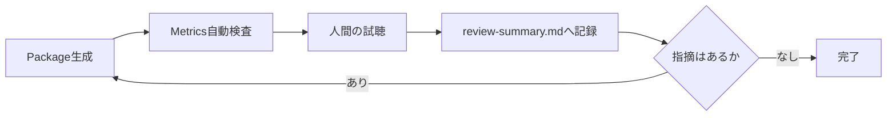

# Testing and Sound Review

## 本書の範囲

本書はSonalloyの**検証プロセス**を定義します。Testの配置と記述ルール、Native境界の検証、音声Reviewのルールと流れです。

| 本書に書かないこと | 参照先 |
|---|---|
| 個々のReview結果の記録 | `review-output/*/review-summary.md` |
| Review Scriptの責務 | `scripts/review/README.md` |
| 製品仕様 | `docs/architecture.md` ほか |

## テスト配置

| 対象 | 場所 |
|---|---|
| Moduleの内部契約 | 実装と同じ`src/`のUnit Test |
| CrateのPublic API経路 | 対象Crateの`tests/`のIntegration Test |
| Workspace直下 | Testを置かない |
| 複数Testで共有する期待値 | `testdata/expected/` |

## テスト記述ルール

- 1つのTestで1つの振る舞いを検証する
- 実装の内部構造ではなく、公開された結果・Error・状態遷移を検証する
- 時刻・乱数・外部Service・音声Deviceに依存しない
- Native境界の故障経路はTest用故障注入で検証する（通常のBuildには含めない）

## Native境界の検証

- C++からRustへ例外を越境させず、Result Codeへ変換する
- Native Error時は出力Bufferを無音化し、Error・Buffer長・所有権・Destroy・Resetを検証する
- Guard付きTestでProcess領域外が変更されていないことを確認する
- Native境界を含むTestはLinux CIでASan / UBSan / Leak検出の対象にする

## 音声Review

- Metricsは`scripts/review/measure_wav.py`でWAVから生成する（手入力しない）
- 自動Testの期待値は`testdata/expected/sine_metrics.json`で管理する
- Metrics合格は音質合格ではない。最終判断は人間が試聴して行う

## Review Package

### Basic Poly Synth

- 保存先：`review-output/basic-poly-synth/`（audio / definitions / midi / metrics.json / review-summary.md）
- 生成：`python scripts/review/generate_basic_poly_synth_package.py`
- Metrics：Finite性、Peak / RMS / DC、推定周波数、隣接Frame差分、Block Size 64 / 257 / 1024での再現比較
- 人間の確認：Saw高音域、Note境界、Attack/Release、同音連打、Voice Stealing、Filter/Velocity、楽曲での実用性

### Metallic Hybrid

- 保存先：`review-output/metallic-hybrid/`（audio / definitions / midi / assets / metrics.json / review-summary.md）
- 生成：`python scripts/review/generate_metallic_hybrid_package.py`
- Metrics：Basicと同じ内容に加え、Sample Layerの有効状態、AssetのSHA-256一致、Sample-onlyの非無音性、Hybrid MixとOscillator-onlyの差分を検査
- 人間の確認：原音との差、Pitch品質、Sample終端のClick、Attackの初速、Bodyの芯と余韻、SoloとMixの一体感、Velocityの自然さ、Phraseでの実用性

試聴の際は同じ再生環境・音量で比較し、確認結果を`review-summary.md`へ記録します。
