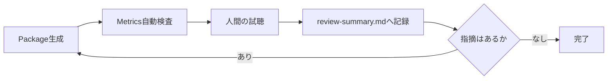

# Testing and Sound Review

## 本書の範囲

本書はSonalloyの**検証プロセス**を定義します。Testの配置と記述ルール、Native境界の検証、音声Reviewのルールと流れです。

| 本書で扱わない内容 | 参照先 |
|---|---|
| 個々のReview結果の記録 | `review/*/review-summary.md` |
| Review成果物の管理・運用ルール | [`review/README.md`](../review/README.md) |
| Review Scriptの責務 | `review/generate/README.md` |
| Fixture（testdata）の管理・運用ルール | [`testdata/README.md`](../testdata/README.md) |
| 製品仕様 | `docs/architecture.md` ほか |

## テスト配置

| 対象 | 場所 |
|---|---|
| Moduleの内部契約 | 実装と同じ`src/`のUnit Test |
| CrateのPublic API経路 | 対象Crateの`tests/`のIntegration Test |
| Workspace直下 | Testを置かない |
| 複数Testで共有する期待値 | `testdata/expected/` |

## テスト記述ルール

- 1つのTestで1つの振る舞いを検証する
- 実装の内部構造ではなく、公開された結果・Error・状態遷移を検証する
- 時刻・乱数・外部Service・音声Deviceに依存しない
- Native境界の故障経路はTest用故障注入で検証する（通常のBuildには含めない）

## Native境界の検証

- C++からRustへ例外を越境させず、Result Codeへ変換する
- Native Error時は出力Bufferを無音化し、Error・Buffer長・所有権・Destroy・Resetを検証する
- Guard付きTestでProcess領域外が変更されていないことを確認する
- Native境界を含むTestはLinux CIでASan / UBSan / Leak検出の対象にする
- Modal ResonatorはMode Count、Parameter Ramp、Prepare前Process、Reset、Native Exception、Non-Finite出力時の無音化を検証する
- Time Stretch境界ではMono / Stereo、Pitch、入力・出力Latency、無効なHandle・Buffer、Native故障時の無音化を検証する
- Stretchを使うRuntimeでは、Prepare後のProcessが追加Allocationを発生させず、Reset後に同じ出力を生成することを検証する

## Dynamic Parameterの検証

Dynamic Parameterを追加・変更した場合は、次の観点をUnit TestまたはIntegration Testで検証します。

- Parameter IDの重複、未知のTarget / Source、Range違反がCompile時に診断される
- Parameter Change、Pitch Bend、Mod Wheel、Aftertouchが絶対Frame位置へ反映され、Coreは同一Offsetを入力順に処理し、Offline AdapterはCanonical順へ正規化する
- Layer Gain / Pan / Tuning、Layer / Voice / Global Processor ParameterがTargetのUnitとRangeへ変換され、Route加算後にClampされる
- LFO、Modulation Envelope、Random、Velocity、Key TrackingのSourceが同じDefinitionとEventから決定的に再現される
- Block Sizeを変更してもSourceの時間軸、Event位置、出力のFinite性が変わらない
- Reset後の出力が初回Renderと一致し、Voice Stealing後も新旧VoiceのParameter Stateが混ざらない
- MIDIのControl Channel統合WarningとNote Event必須条件がCLI経路で検証される
- NativeのOscillator / Filter Rampが有効なBuffer境界を守り、故障時に無音化とError伝播を行う

Testは時刻、外部MIDI Device、OS依存の乱数、File更新時刻に依存させず、乱数SeedとEvent Sequenceを固定します。公開経路は`tests/`、内部計算は実装Module内のUnit Testへ置きます。

## Realtime Adapter Review

Realtime Adapterの自動検証は物理Deviceを使用せず、CoreとDevice非依存のAdapter境界を確認します。Audio Deviceの列挙、Stream生成、実際の鍵盤応答は人間のReviewで行い、OfflineのWAV品質判定とは分けて記録します。

| 自動確認 | 観点 |
|---|---|
| Callback分割 | Host Callbackの1、63、64、255、256、257、511、641、1024 FrameをCore最大Block以下へ分割し、絶対Frameを連続させる |
| Channel / Format | StereoのLeft / Right、3ch以上の余剰Channel無音、PCMの符号付き・符号なし・24-bitを含むSample Format変換 |
| Queue / 順序 | Emptyから4096 Event、Timestamp + Sequence順、同一Timestampの入力順、Note On / Note Off / Sustainの時系列回帰、4097個目のPushで既存Eventを保持したままFatal化 |
| Fault / Status | Process Error・Audio Error・MIDI Error・Queue Overflowの無音化と原因別Diagnostic、RealtimeDeniedのWarning、XrunのCounter、Device lossのFatal化 |
| Callback安全性 | Eventあり・なし、Host Callback分割、Multi-channelを含むAudio Callback本体のAllocation 0 |

物理Deviceを使うReviewでは、Release BuildでWindowsとLinuxを確認します。最初に`sonalloy device list`でAudio Output / MIDI Inputの名前とOpaque IDを確認し、`sonalloy device list --json`で機械可読ReportのFieldと`buffer_size: null`を含む未知値の表現を確認します。

| 確認 | 内容 |
|---|---|
| 起動 | `sonalloy play <definition> --midi-device <id>`で選択Device、Sample Rate、Channel、Sample Format、要求Buffer、Engine Latency、Tempoが表示される |
| 入力 | Note On / Note Off、Velocity 0、同音重複、Pitch Bend、Mod Wheel、Channel Aftertouch、Sustain Down / Upを確認する |
| 音色 | 既存のBasic、Expressive、Physical / Modal、Spectral / Granular ReferenceでGenerator、Processor、Global TailがRealtime経路でも機能する |
| Buffer | 256 Frameを通常の完了判定対象、128 Frameを追加評価として記録する。Hostが要求値と異なるCallbackを返しても音切れ・停止がない |
| 長時間 | 各OSでRelease Buildを10分以上連続演奏し、Fatal Fault、Stuck Note、Queue Overflow、通常利用中の継続的Xrun、Memoryの継続増加がない |

Review結果は`review/realtime-performance/`へ記録します。Machine-specificなOpaque IDは公開Artifactへ残さず、Device Name、Backend、Sample Rate、要求Frame、観測したCallback Frameの最小値・最大値・回数、Engine Latency、時間、Xrun、Fatal状態、入力応答を記録します。

## 音声Review

- Metricsは`review/generate/measure_wav.py`でWAVから生成する（手入力しない）
- 自動Testの期待値は`testdata/expected/`で管理する
- Metrics合格は音質合格ではない。最終判断は人間が試聴して行う
- 同じ再生環境・音量で比較し、結果を`review-summary.md`へ記録する

## Review Package

### 共通仕様

各Packageは検証対象ごとにWAV・Definition・MIDI・Metricsをまとめた単位です。

| 項目 | 内容 |
|---|---|
| 保存先 | `review/<package>/`（`audio/technical` / `definitions` / `events` / `midi` / `assets` / `inspect` JSON / `metrics.json` / `review-summary.md`、対象により構成が異なる） |
| 生成 | 各Packageの`review/generate/generate_*.py`を実行する |
| 基本Metrics | Finite性、Peak / RMS / DC、Sample Rate 44.1 / 48 / 96 kHz、Block Size 32 / 64 / 257 / 1024での比較、Fresh Runtime再現性 |
| 自動確認 | Definition Validate、Inspect JSON、Resource Limit、Parameter Lifecycle等をTestで検証する |
| 音声の扱い | 技術確認用の生出力（`audio/technical/`）をMetricsと試聴で共用する。試聴専用の正規化コピーは保存せず、音量は再生側で調整する |
| Performance | 対象PackageはRelease BuildでRender時間・Realtime比を`metrics.json`へ記録する（Performance専用WAVは一時Directoryへ出力し、Packageへ保存しない） |

### パッケージ一覧

| Package | 対象 | 確認の要点 |
|---|---|---|
| Basic Poly Synth | Saw基本音源 | 高音域、Note境界、Attack / Release、同音連打、Voice Stealing、Filter / Velocity |
| Metallic Hybrid | Sample + Oscillator Hybrid | 原音との差、Pitch品質、Sample終端のClick、Attackの初速、Solo / Mixの一体感 |
| Dynamic Parameters | Parameter Change、LFO、Modulation Envelope、Random、External Control | LFO周期と位相、Envelope、Velocity、Key Tracking、Random Pan、Pitch Bend連続性、Mod Wheel / Aftertouch |
| Processor Chain | Layer / Voice / Global Processor、Reset | Layer範囲、Drive質感とAliasing、Delay間隔・Feedback・定位、Reverb初期反射・Tail・Damping・Width |
| Processor Expansion | Filter 4 Mode、EQ、Resonator、Bitcrusher、Chorus、Flanger、Phaser、Compressor、Limiter、Full Chain 3 | Mode差、帯域変化、Pitch / Decay、Digital Texture、Stereo幅、Sweep、Punch、Peak Ceiling、実用性 |
| Basic Generator | Band-limited波形、Pulse Width、PWM、Noise色、Stereo Correlation | 波形間音色差、高音域Alias、Pulse Width差、PWMのClick、Noise色、Stereo幅、新規Runtime間の冒頭一致 |
| Harmonic / Formant | Additive（Partial / Morph / Tilt / Inharmonicity / Envelope）、Formant（Vowel / Shift / Throat / Tilt）、Hybrid | 基音と倍音の明瞭さ、Inharmonic Bellの金属感、Morph / Tilt / Inharmonicity連続性、各Vowelの共鳴、Vowel Morph、Formant Shiftで基音不変、Hybrid音色成立 |
| Digital Synthesis | Wavetable、4 Operator Modulation、Complex Oscillator、Digital Hybrid（40音源） | Frame / Position、Band切替、PM / FM / AM / Ring、Algorithm、Feedback、Phase Distortion、Wavefold、Unison、Hybrid音色成立 |
| Physical / Modal | Physical String、Modal、String + Modal Hybrid | StringのPitch / Decay / Brightness / Stiffness、ModalのMode Count / Structure / Brightness / Decay、Note Lifecycle、Processor統合、Reset / Block Size / Sample Rate |
| Spectral Resynthesis | Spectral A / B、Position、Freeze、Blur、Shift、Morph、Hybrid、16 Voice、既存Generator回帰 | 元WAVとの一致（音色・Transient・Noise Floor）、Source Segment、Freeze中の音色と連続Phase、Blur拡散、A / B Morph連続性、Pitch維持、Shift移動、Latency後の時間位置、Mono / Stereo定位 |
| Essential Sampling | Key Zone、Velocity Layer、Round Robin、Stereo、Forward / Reverse、Loop、Crossfade、Release Trigger、Fixed Stretch、Tempo Sync | Key / Velocity境界、Pitch Mapping、Round Robin順、Stereo Image、Reverse方向感、Loop周期とClick、Crossfade連続性、Release発音タイミング、Stretch Pitch保持、Tempo SyncのBPM変化 |
| Granular | Granular Pad、Vocal Freeze、Percussion Cloud、Position Scrub、Stereo Source、Polyphony | Grain開始・終了のClick、Density密度、Grain Size質感、Pitch、Randomness広がり、Pan Spread、Scrub追従、Freeze持続、Vocal明瞭さ、Percussion Transient |
| Wave Sequence | Single Step、Direction（Forward / Reverse / Ping Pong）、Loop、One-shot / Loop Step、Duration Type、Tempo Change、Crossfade、Step Pitch / Gain、Missing Step、Stereo / Mono混在 | Direction順序と端Step重複、One-shot終端無音、Loop境界、定電力Crossfade、Step Pitch / Gain、Missing Step無音区間、Mono / Stereo定位、Tempo Change、Reset同一性 |
